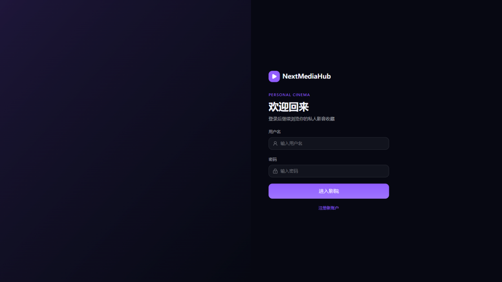
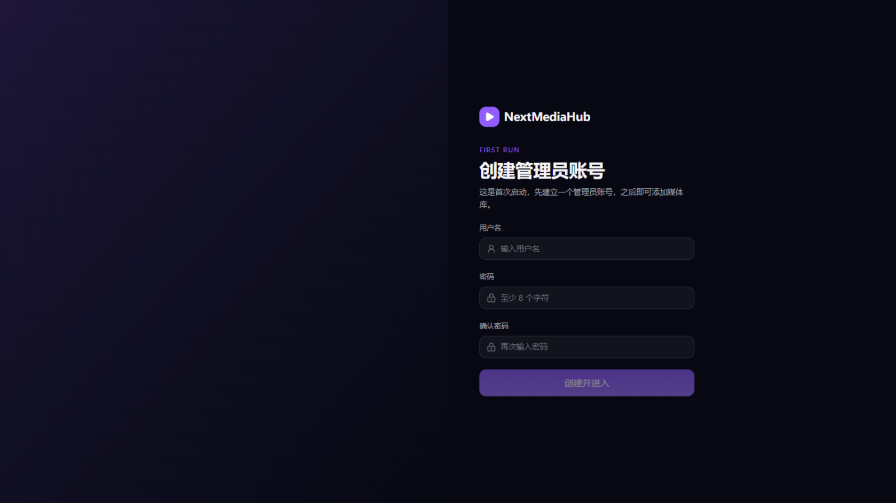

# 2. 首次使用

[← 返回目录](README.md)

## 1. 打开服务

浏览器访问 **`http://服务器地址:18096/`**（部署在本机就是 `http://127.0.0.1:18096/`）。未登录时会看到登录页；全新安装会自动跳到安装向导。

## 2. 创建管理员账号

首次启动会出现「创建管理员账号」页面：填写用户名和密码（至少 8 位），点击**创建并进入**。这个账号就是服务器的管理员。

创建成功后直接进入观影端首页。

## 3. 认识两个界面

NextMediaHub 有两套界面，同一账号体系：

- **观影端**（根路径 `/`）：看片用的，所有用户都用这套。
- **管理控制台**（`/admin`）：管理媒体库、用户、系统设置的，只有管理员能进。

两边切换的入口：

- 观影端左下角 **「管理控制台」** 链接（仅管理员可见）；
- 控制台左上角点击 **NextMediaHub 标志** 回到观影端。

### 管理控制台导览

左侧导航按使用频率分四组：

| 分组 | 页面 | 什么时候用 |
| --- | --- | --- |
| **工作台** | 运行概览、任务中心 | 每天瞄一眼：有多少媒体、谁在看、任务跑完没有 |
| **内容** | 媒体、媒体库、虚拟库榜单、封面工作室、媒体信息、片头片尾、演职人员 | 整理内容时 |
| **运行** | 播放活动、转码管理、系统日志、协议抓包 | 排查问题时 |
| **系统** | 用户与权限、API 密钥、元数据服务、通知、运行设置 | 配置一次基本不动 |

顶部的**命令面板**（⌘K / Ctrl+K）可以快速跳转任意页面；「实时」标记表示页面数据会自动刷新。

## 4. 接下来：把电影放进来

回到观影端会发现还是空的——因为还没有媒体库。前往 **[3. 媒体库管理](03-媒体库管理.md)** 创建第一个媒体库并扫描。

## 5. 用 Emby 客户端观看

除了网页，官方 Emby 客户端（手机、电视盒子、智能电视）和 Infuse 等兼容应用都能直接使用：

1. 在客户端中**添加服务器**，地址填 `http://服务器地址:18096`；
2. 输入 NextMediaHub 的用户名密码登录；
3. 首页推荐、播放进度同步（接着看）、剧集「下一集」等功能与 Emby 一致。

观影端与 Emby 客户端的观看进度互通：网页看到一半，电视上打开能继续。

## 6. 修改自己的密码

点击右上角头像 → **账户与安全**，可以修改密码；如果管理员发了「注册卡密」，也在这一页兑换以延长访问有效期。

