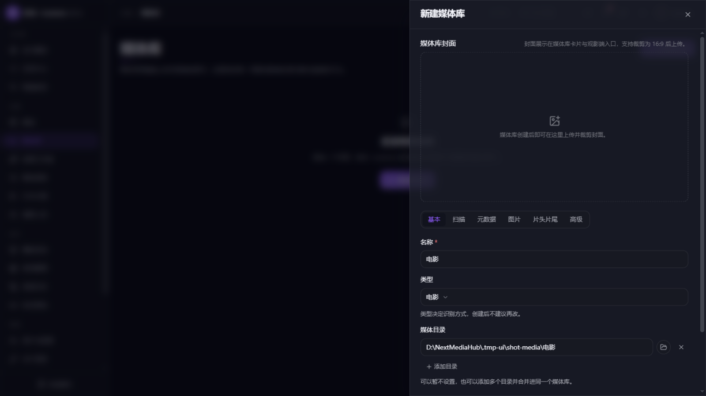
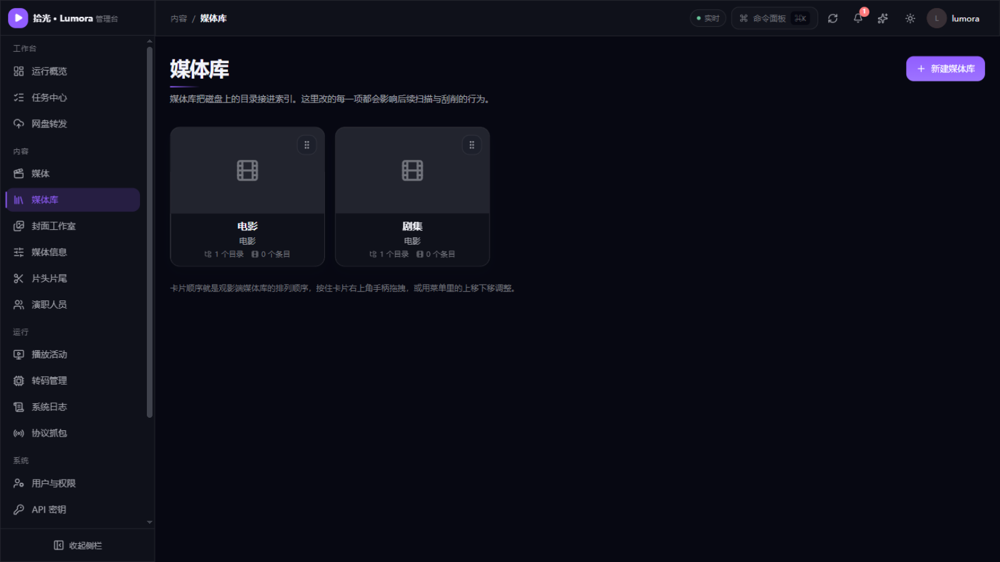
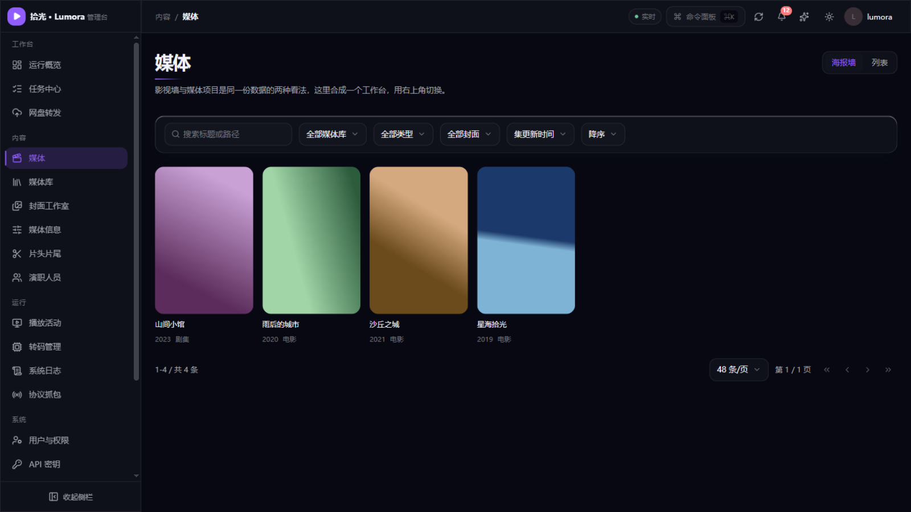

# 3. 媒体库管理

[返回使用指南](README.md)

媒体库 = 一个影片文件夹 + 一套识别规则。管理入口：**管理控制台 → 内容 → 媒体库**。

## 1. 新建媒体库

点击右上角**新建媒体库**，右侧弹出创建抽屉：



按顺序做四件事：

1. **名称**：起个好名字，比如「电影」「剧集」，观影端侧栏会显示它。
2. **类型**：选「电影」或「剧集」。类型决定识别方式，**创建后不建议再改**（剧集库才会分季分集、支持片头片尾检测）。
3. **媒体目录**：填写影片所在文件夹的完整路径，或点击右侧 📁 按钮从服务器磁盘浏览选择。一个库可以点「添加目录」挂多个文件夹（比如两块硬盘的电影并入同一个「电影」库）。
4. 点击底部**创建**。

创建抽屉按**基本信息、目录、扫描、元数据、图片**分区，常用开关集中在「扫描」和「元数据」分区，保持默认即可：

| 开关 | 默认 | 说明 |
| --- | --- | --- |
| 监听目录变化 | 开 | 文件夹里新增/删除文件后自动入库，不用手动扫描 |
| 启动时扫描 | 关 | 每次服务启动时对该库做一次完整扫描；影片在 NAS/网络盘上时可开启作为兜底 |
| 探测媒体信息 | 开 | 入库时用 FFprobe 读取分辨率、音轨、字幕等信息 |
| 刮削元数据 | 开 | 自动匹配海报和简介（来源顺序见下） |
| 前台显示未识别内容 | 关 | 关闭时，识别失败的条目只在管理端可见、不出现在观影端（管理端补全识别后自动出现） |
| 元数据来源 | NFO、TMDB、TVDB | 按顺序依次尝试；只勾「本地 NFO」即纯本地库，默认不联网刮削（补全规则可显式放行 TMDB，见[元数据](04-元数据刮削.md#3-补全规则与图片)） |

> 默认会忽略隐藏文件和 `nfo` / `jpg` / `png` 等非媒体扩展名，避免把海报、NFO 当成影片入库；需要调整时改「扫描」分区的对应配置。

媒体分析的速度限制（每秒最多启动多少次媒体信息探测、片头片尾检测）统一在 **运行设置 → 性能** 中调整，对全部媒体库生效。

## 2. 扫描入库

创建好的库显示为一张卡片：



- 点卡片上的**扫描**立即检查一次文件夹（新增、变更、删除都会同步）；
- 平时不用管：目录监听会自动处理变化，计划的兜底扫描见[任务与计划任务](07-任务与计划任务.md)。

扫描、探测、刮削都是后台任务，进度在 **工作台 → 任务中心** 可见，跑完后媒体自动出现在观影端。

## 3. 查看入库结果

**管理控制台 → 内容 → 媒体** 是全部影片的工作台，海报墙/列表两种视图可切换：



点任意卡片进入影片详情，可核对海报、简介、演职员，或[重新识别](04-元数据刮削.md#4-识别错了怎么办手动识别)。

## 4. 文件夹怎么摆最好认

推荐「片名 (年份)」文件夹 + 文件带年份的命名方式，识别成功率最高：

```text
电影/
├── 星海拾光 (2019)/
│   └── 星海拾光 (2019).mkv
└── 沙丘之城 (2021)/
    └── 沙丘之城 (2021).mkv

剧集/
└── 山间小馆 (2023)/
    ├── Season 1/
    │   ├── 山间小馆 - S01E01.mkv
    │   └── 山间小馆 - S01E02.mkv
    └── Season 2/
        └── 山间小馆 - S02E01.mkv
```

命名不规范也没关系，入库后可以[手动识别修正](04-元数据刮削.md#4-识别错了怎么办手动识别)。

## 5. 网络盘（NAS）注意事项

影片放在 SMB/NFS 挂载或 Docker Desktop 文件共享路径上时：

- 这类挂载可能收不到文件变化事件 → 新文件不会被自动发现。解决办法：等[「全库扫描」计划任务](07-任务与计划任务.md#2-计划任务定时自动维护)兜底，或在部署时开启轮询模式（`LIBRARY_WATCH_FORCE_POLLING=true`，见 Compose 配置）。
- 网络盘响应慢时服务会自动限速保护，扫描变慢属正常现象；可在「运行设置 → 性能」中把媒体信息或片头片尾 QPS 调低（如 2）。该处不控制在线元数据和图片下载，它们同在「运行设置 → 性能」中分别配置。

## 6. 编辑与删除

- **编辑**：修改名称、增删目录、调整开关；类型不可更改。
- **排序**：按住卡片右上角手柄拖拽，或用卡片菜单的上移/下移——这个顺序就是观影端侧栏的库顺序。
- **删除媒体库**：卡片菜单里删除，只清除索引，**不会删除磁盘上的影片文件**。

## 下一步

- 海报没出来或识别错了 → [4. 海报与简介（元数据）](04-元数据刮削.md)
- 想让家人各自有账号 → [6. 用户与权限](06-用户与权限.md)
