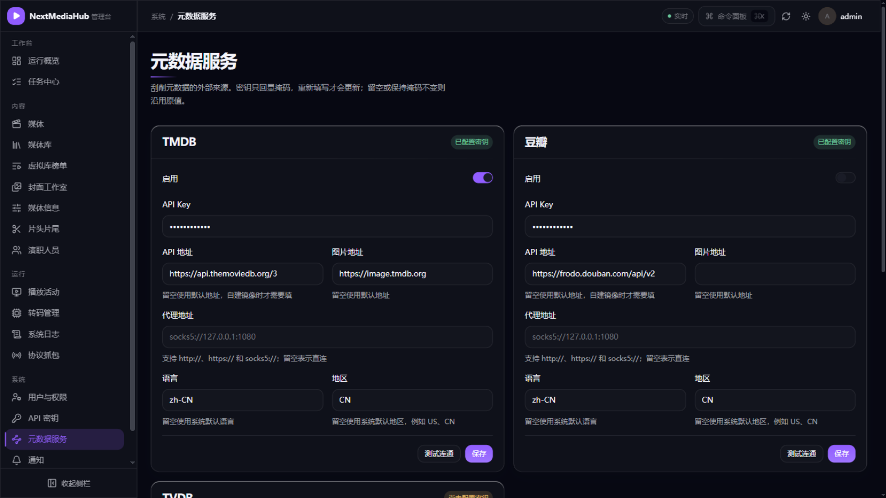
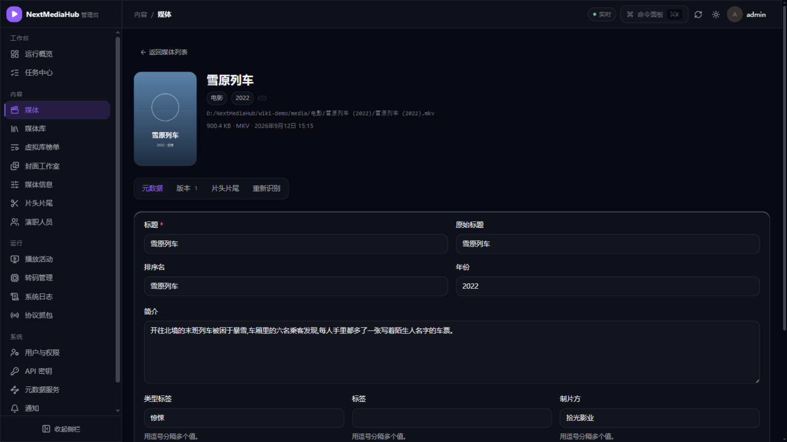
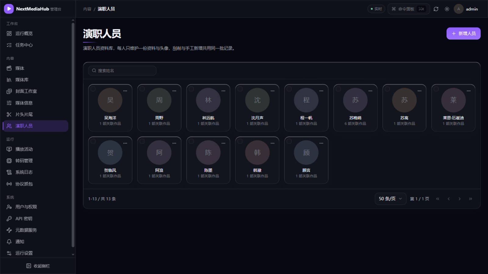

# 4. 海报与简介（元数据）

[← 返回目录](README.md)

入库的影片会自动匹配海报、简介、演职员和评分。这一页讲：用哪个数据源、怎么配置、识别错了怎么改。管理入口：**管理控制台 → 系统 → 元数据服务**。

## 1. 数据源怎么工作

匹配顺序是「**本地文件优先，在线来源兜底**」：

1. **本地 NFO**：影片文件夹里的 `movie.nfo` / `tvshow.nfo` 和 `poster.jpg` 等文件。如果你从别的服务器搬家过来、已经整理过，这些文件会被原样采用。
2. **TMDB**：默认启用的在线来源。API Key 留空时使用内置凭据，开箱即用。
3. **豆瓣**（可选）：补充中文简介、评分和演员中文名，默认关闭，见下文[启用豆瓣](#4-启用豆瓣中文增强)。

## 2. 配置数据源

**管理控制台 → 系统 → 元数据服务**：

每个来源一张卡片，常用配置：

| 配置 | 什么时候改 |
| --- | --- |
| 启用开关 | 想关掉某个来源（比如只用本地 NFO） |
| API Key | 有自己的 TMDB Key 时填写；留空用内置的 |
| API 地址 / 图片地址 | TMDB 直连不畅时换成镜像站 |
| 代理地址 | 支持 `http://`、`https://`、`socks5://`，填后所有在线请求走代理 |
| 语言 / 地区 | 默认 `zh-CN` / `CN`，一般不用动 |
| 请求 QPS | 每秒最多发起的元数据 API 请求数；遇到超时、429 或漏刮时建议调低 |
| 图片下载 QPS | 每秒最多发起的海报、背景图和人物头像下载请求数 |

改完点**保存**，旁边的**测试连通**可以立即验证配置是否可用。密钥只显示掩码，重新填写才会更新。

QPS、API 地址、图片地址和代理支持任务运行时热更新：保存后，正在运行的长任务会在下一处理批次使用新配置，通常不超过约 2 秒。已经发出的请求不会被强制中断，避免同一影片重复请求或留下半成品。配置按短时间缓存并复用连接，不会为每张图片或每次 API 请求读取数据库。

如果 TMDB ID 明明正确但仍有少量漏刮，通常不是识别错误，而是请求过密、镜像不稳定、代理连接失败或上游限流。可先把「请求 QPS」调到 `1`～`2`，测试连通后重新执行失败项目；只有图片缺失时则单独调低「图片下载 QPS」，无需降低媒体分析速度。

## 3. 识别错了怎么办（手动识别）

文件名太怪导致匹配错影片时：

1. **管理控制台 → 内容 → 媒体**，点开有问题的影片。
2. 详情页顶部有四个标签：**元数据 / 版本 / 片头片尾 / 重新识别**。点**重新识别**。

3. 按提示搜索正确的片名，从候选列表中选中，确认后服务会重新拉取该剧/影片的全部信息（提交为后台任务）。

在详情页还可以直接**编辑字段**（标题、简介、类型标签、制片方等）并保存；被你手动锁定/编辑的内容不会被自动刮削覆盖。

## 4. 启用豆瓣（中文增强）

豆瓣提供中文简介、译名和演员中文名，作为 TMDB 之后的补充：

1. 在「元数据服务」中打开**豆瓣**卡片的启用开关（凭据留空用内置的），保存。
2. 打开 **工作台 → 任务中心 → 计划任务**，启用「**构建豆瓣元数据缓存**」并点**立即执行**（任务会按入库顺序逐个补全中文信息，为避免被豆瓣限速，速度固定为单线程慢速）。

豆瓣数据只会补空和补充中文，不会覆盖已有的中文内容。

## 5. 演职人员

**管理控制台 → 内容 → 演职人员** 汇总所有演员/导演，可补缺失的头像；点进人物可看其参演作品。观影端影片详情页点演员即可跳转人物页。

## 下一步

- 识别、刮削都是后台任务 → [7. 任务与计划任务](07-任务与计划任务.md)
- 让剧集支持跳过片头 → [8. 特色功能 · 片头片尾](08-特色功能.md#2-跳过片头片尾)
