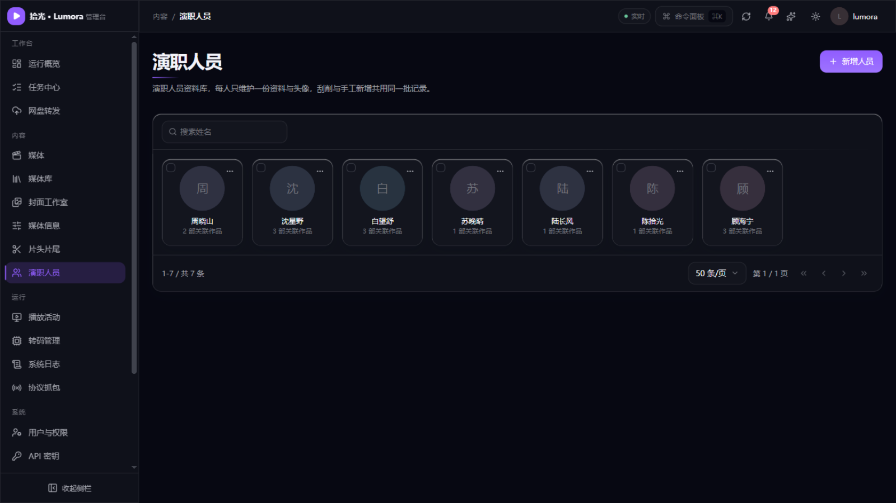

# 4. 海报与简介（元数据）

[返回使用指南](README.md)

入库的影片会自动匹配海报、Logo、简介、演职员和评分。这一页讲：用哪个数据源、怎么配置、识别错了怎么改。提供方入口是 **管理控制台 → 系统 → 元数据服务**，补全规则入口是 **管理控制台 → 系统 → 运行设置 → 元数据**。

## 1. 数据源怎么工作

匹配顺序是「**本地文件优先，在线来源兜底**」：

1. **本地 NFO**：影片文件夹里的 `movie.nfo` / `tvshow.nfo` 和 `poster.jpg` 等文件。如果你从别的服务器搬家过来、已经整理过，这些文件会被原样采用。
2. **TMDB**：默认启用的在线来源。API Key 留空时使用内置凭据，开箱即用。
3. **豆瓣**（可选）：补充中文简介、评分和演员中文名，默认关闭，见下文[启用豆瓣](#5-启用豆瓣中文增强)。

## 2. 配置数据源

**管理控制台 → 系统 → 元数据服务**：

每个来源一张卡片，常用配置：

| 配置 | 什么时候改 |
| --- | --- |
| 启用开关 | 想关掉某个来源（比如只用本地 NFO） |
| API Key | 有自己的 TMDB Key 时填写；留空用内置的 |
| API 地址 / 图片地址 | TMDB 直连不畅时换成镜像站 |
| 代理地址 | 支持 `http://`、`https://`、`socks5://`，填后所有在线请求走代理 |
| 语言 / 地区 | 默认 `zh-CN` / `CN`，一般不用动 |

改完点**保存**，旁边的**测试连通**可以立即验证配置是否可用。密钥只显示掩码，重新填写才会更新。

各来源的**请求限速不在这一页**：元数据请求、图片下载、媒体信息探测与片头片尾检测的 QPS 统一在 **运行设置 → 性能** 中调整，对全部来源生效，保存后立即应用；API 地址、图片地址和代理也支持任务运行中热更新，正在跑的长任务会在下一处理批次用上新配置，已发出的请求不会被强制中断。

如果 TMDB ID 明明正确但仍有少量漏刮，通常不是识别错误，而是请求过密、镜像不稳定、代理连接失败或上游限流。可把「运行设置 → 性能」里的元数据请求 QPS 调到 `1`～`2`，测试连通后重新执行失败项目；只有图片缺失时则单独调低图片下载 QPS，无需降低媒体分析速度。

## 3. 补全规则与图片

「运行设置 → 元数据」是自动补全的唯一配置入口：

- 可按媒体库限制范围，默认检查最近 60 天首播的内容，并可包含无首播日期条目；`0` 天表示不限范围。
- 缺标题、缺简介、缺图片等启用规则按「任意一项命中即处理」；锁定字段不会被覆盖。
- 单集标题形如「第 12 集」「第十二集」会按缺少有效标题处理。
- Logo 默认从 TMDB 获取，电影和剧可持有 Logo，季和集继承所属剧的 Logo。
- 「仅 NFO」媒体库默认不联网；确有需要时可显式允许 TMDB 参与补全。
- 无结果会进入冷却期，避免每天重复访问提供方；任务运行中修改设置只影响下一轮。

媒体库菜单的**刷新元数据**会刷新当前库全部电影、剧、季和集。默认保留已有图片并补缺；勾选「替换所有已有图片」后才重新选择海报、背景图、剧照和 Logo。图片下载失败时保留旧图，锁定字段始终保持不变。

## 4. 识别错了怎么办（手动识别）

文件名太怪导致匹配错影片时：

1. **管理控制台 → 内容 → 媒体**，点开有问题的影片。
2. 详情页顶部有四个标签：**元数据 / 版本 / 片头片尾 / 重新识别**。点**重新识别**。

3. 按提示搜索正确的片名，从候选列表中选中，确认后服务会重新拉取该剧/影片的全部信息（提交为后台任务）。

在详情页还可以直接**编辑字段**（标题、简介、类型标签、制片方等）并保存；被你手动锁定/编辑的内容不会被自动刮削覆盖。

## 5. 启用豆瓣（中文增强）

豆瓣提供中文简介、译名和演员中文名，作为 TMDB 之后的补充：

1. 在「元数据服务」中打开**豆瓣**卡片的启用开关（凭据留空用内置的），保存。系统会自动把豆瓣接在 TMDB 之后并启用独立增强任务。
2. 在「运行设置 → 元数据」配置评分更新周期、季表周期和辅助应用范围。
3. 首次使用或需要重建缓存时，打开 **工作台 → 任务中心 → 计划任务**，对「**豆瓣缓存构建**」点**立即执行**。任务会复用有效缓存并增量维护；为避免被豆瓣限速，所有媒体库共用串行通道。

豆瓣数据只会补空和补充中文，不会覆盖已有的中文内容。

## 6. 演职人员

**管理控制台 → 内容 → 演职人员** 汇总所有演员/导演，可补缺失的头像；点进人物可看其参演作品。观影端影片详情页点演员即可跳转人物页。

## 下一步

- 识别、刮削都是后台任务 → [7. 任务与计划任务](07-任务与计划任务.md)
- 让剧集支持跳过片头 → [8. 特色功能 · 片头片尾](08-特色功能.md#3-跳过片头片尾)
