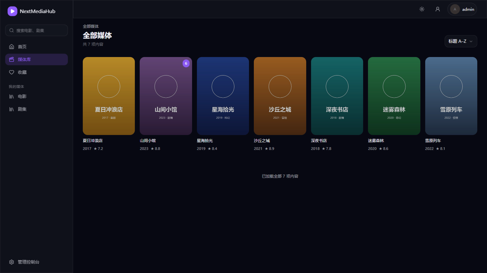
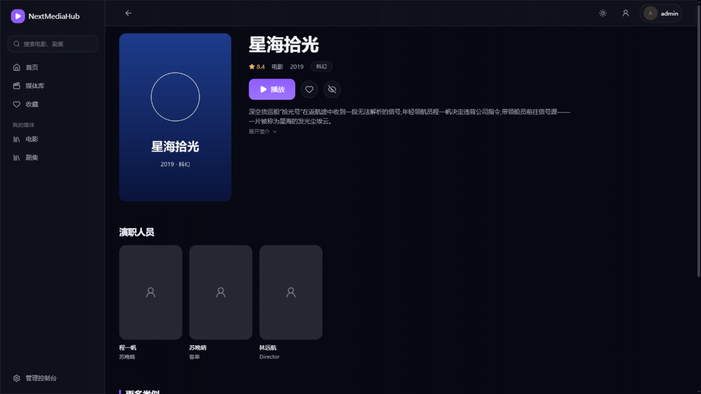
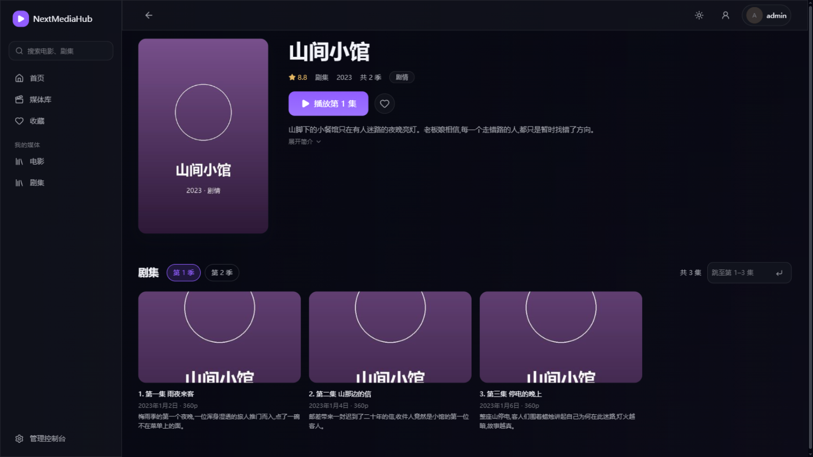
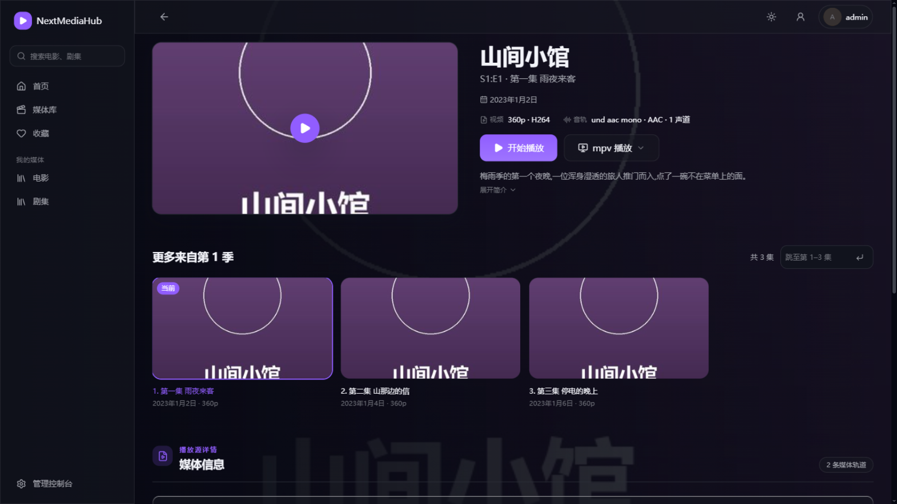
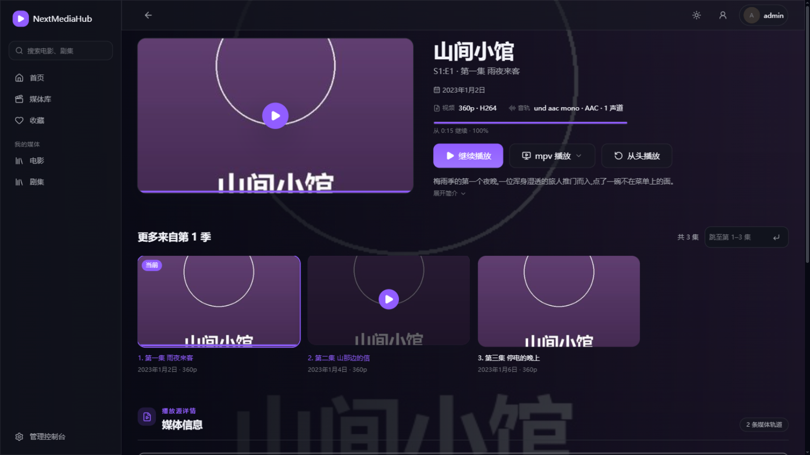
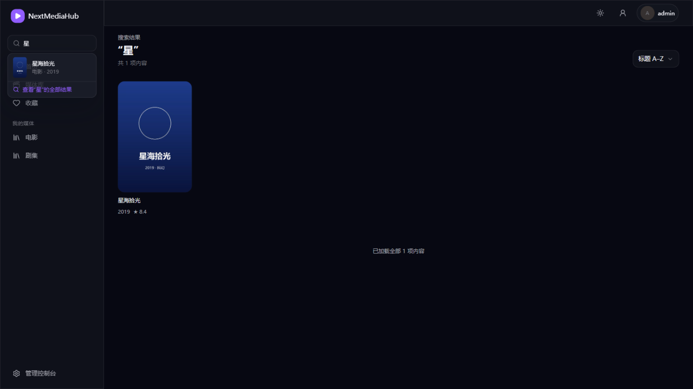
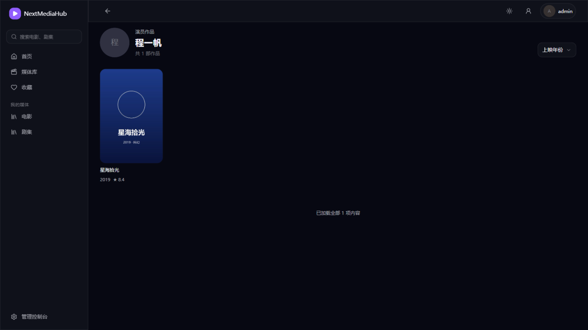

# 5. 观影使用

[返回使用指南](README.md)

这一页介绍观影端的每个界面和播放相关的全部操作。观影端所有人都能用，浏览器访问 `http://服务器地址:18096/` 即可。

## 1. 首页

登录后进入首页：

- **片库精选**：顶部大图轮播，直接「播放」或「查看详情」。
- **接着看下一集**：追剧进度自动记录，点卡片就从上次的地方继续。
- **全部影片 / 电影 / 剧集** 快捷入口，直达对应海报墙。

## 2. 媒体库浏览

左侧栏点「媒体库」或某个具体库（电影/剧集）：

- 海报上角标数字表示剧集总集数；
- 右上角可切换排序（标题、上映年份等）；
- 左侧搜索框输入片名随时过滤。

## 3. 影片详情

点海报进入详情页：

- 评分、年份、类型、简介、演职员一览；
- **▶ 播放**直接开播；♡ 收藏；👁 标记已看；
- 剧集详情会显示**分季标签**和每集的缩略图、标题、播出日期和简介，点哪集播哪集：

## 4. 起播准备页

点击播放后先进入准备页，确认音视频信息后开播：

- 显示这一集的画质（如 360p·H264）、音轨信息；
- **开始播放**进入播放器；**mpv 播放**可以把画面投给本机安装的 mpv 播放器（下拉可切换外部播放方式）；
- 底部「更多来自第 1 季」可快速换集。

**看了一半退出后**，再次打开会显示上次播放位置。点击**继续播放**接着看，或点击**从头播放**重新观看：

## 5. 播放器

播放器占满整个页面：

- 底部控制条：播放/暂停、音量、进度条（可拖动跳转）、设置、全屏；
- 鼠标移动时控制条出现，几秒无操作自动隐藏；
- 左上角「正在播放」标题和返回箭头随时可退出；
- 播放进度实时上报，换设备打开能继续。

## 6. 搜索

左侧搜索框输入即出候选提示，回车进入搜索结果页：

支持中文模糊匹配，也支持拼音和拼音首字母（比如输入 `xhsg` 也能找到《星海拾光》）。

## 7. 人物页

详情页点任意演员，进入人物页查看参演作品：

## 8. 收藏与个人中心

- **收藏**：左侧栏「收藏」查看所有标记 ♡ 的影片。
- **账户与安全**：右上角头像进入，可改密码，见[首次使用](02-首次使用.md#6-修改自己的密码)。

## 下一步

- 想在电视/手机上看 → [Emby 客户端连接](02-首次使用.md#5-用-emby-客户端观看)
- 播放转码卡顿？→ [9. 日志与常见问题](09-日志与常见问题.md)
