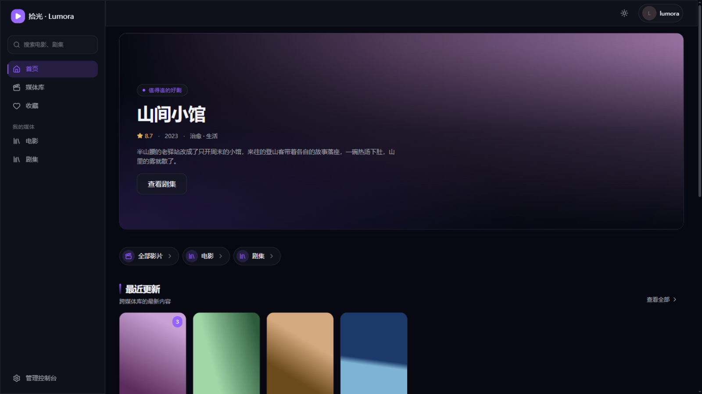
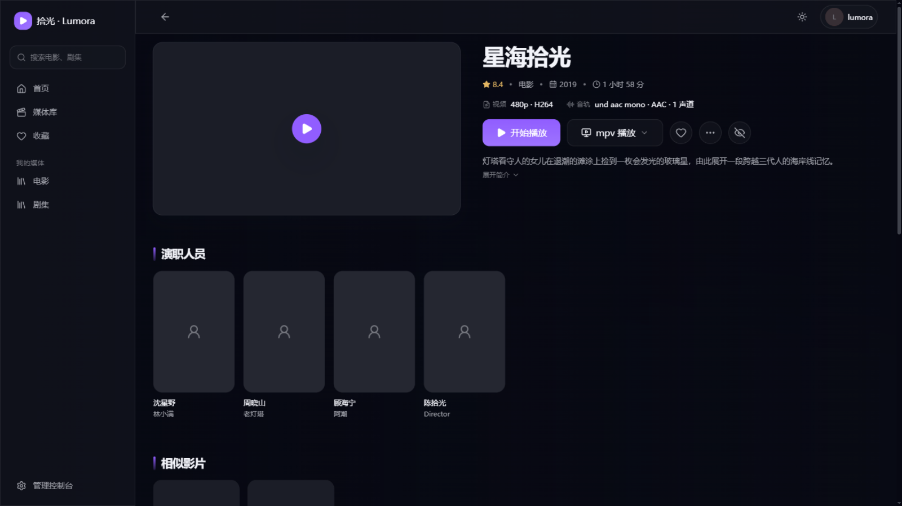
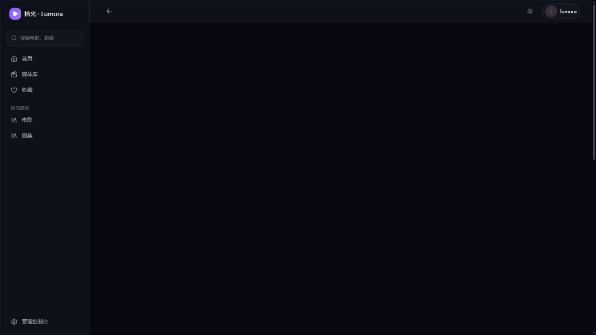
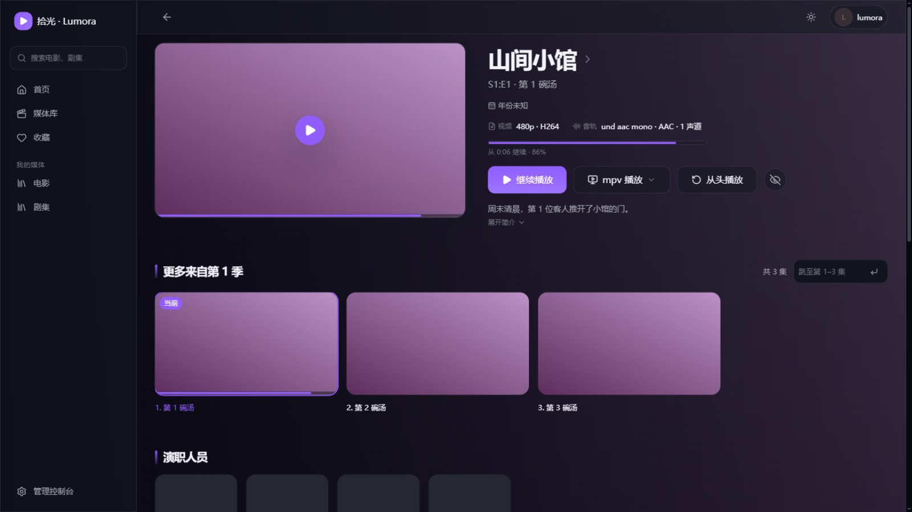
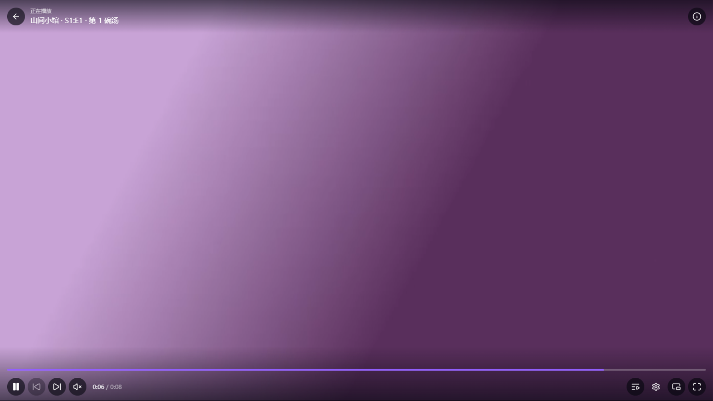
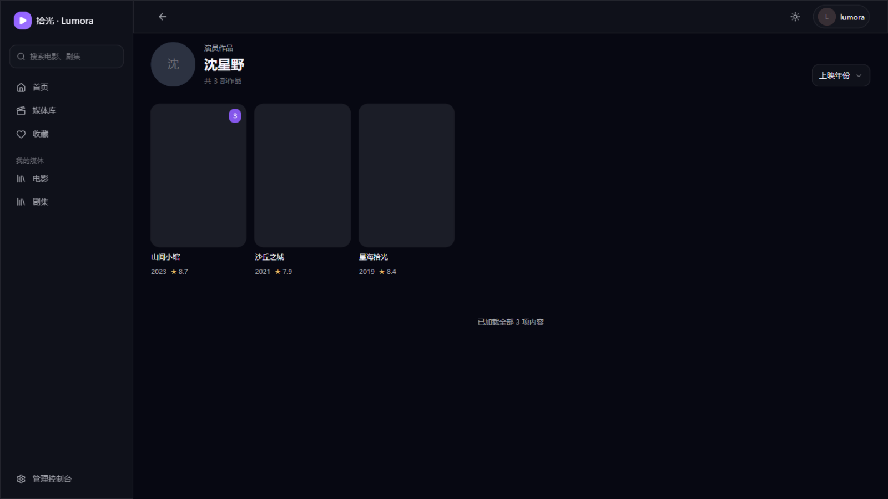

# 5. 观影使用

[返回使用指南](README.md)

这一页介绍观影端的每个界面和播放相关的全部操作。观影端所有人都能用，浏览器访问 `http://服务器地址:18096/` 即可。

## 1. 首页

登录后进入首页：

- **片库精选**：顶部大图轮播，直接「播放」或「查看详情」。
- **继续观看**：未看完的影片和追剧的下一集集中展示；点卡片可继续播放或接着看下一集。
- **全部影片 / 电影 / 剧集** 快捷入口，直达对应海报墙。

## 2. 媒体库浏览

左侧栏点「媒体库」或某个具体库（电影/剧集）：

- 海报上角标数字表示剧集总集数；
- 右上角可切换排序（标题、上映年份等）；
- 左侧搜索框输入片名随时过滤。

## 3. 影片详情

**剧集**点海报进入详情页：

- 评分、年份、类型、简介、演职员一览；
- **▶ 播放**直接开播；♡ 收藏；👁 标记已看；
- 剧集详情会显示**分季标签**和每集的缩略图、标题、播出日期和简介，点哪集播哪集；季数较多时可用季选择器快速切换：

有对应资料 ID 的影片还可从详情页跳转至 TMDB、TVDB、豆瓣或 IMDb。管理员可在单集卡片上直接打开编辑、刷新和删除等管理操作。

**电影**从首页、媒体库浏览、搜索结果和人物页点开时，会直接进入[起播准备页](#4-起播准备页)开播，少跳一步：

## 4. 起播准备页

点击播放后先进入准备页，把**版本、音轨、字幕和画质**一次选定后开播：

- 顶部显示媒体规格；多版本影片可在**版本**里切换，**画质**默认「原始画质」（直连原片，不经服务器转码）；
- 选择具体转码档位（如 360p·H264）时由服务器实时转码为 HLS 流：带宽不足、设备不支持原编码，或浏览器打不开的片源（如蓝光原盘、部分 HDR/杜比视界编码）用它；
- HDR10／HLG／杜比视界片源转码播放时会自动做 HDR → SDR 色调映射（杜比视界会应用其动态元数据），网页端不再出现发绿、发紫等偏色；浏览器普遍不支持原生杜比视界，这类片源在网页端建议选择转码档位观看；
- **开始播放**进入播放器；**mpv 播放**可以把画面投给本机安装的 mpv 播放器（下拉可切换外部播放方式）；
- 底部「更多来自第 1 季」可快速换集。

**看了一半退出后**，再次打开会显示上次播放位置。点击**继续播放**接着看，或点击**从头播放**重新观看：

## 5. 播放器

播放器占满整个页面：

- 底部控制条：播放/暂停、音量、进度条（可拖动跳转）、设置、全屏；
- 鼠标移动时控制条出现，几秒无操作自动隐藏；
- 左上角「正在播放」标题和返回箭头随时可退出；
- 播放进度实时上报，换设备打开能继续。

## 6. 搜索

左侧搜索框输入即出候选提示，回车进入搜索结果页：

支持中文模糊匹配，也支持拼音和拼音首字母（比如输入 `xhsg` 也能找到《星海拾光》），还能按演职人员找到他参演的作品。拼音兜底、人物搜索、单集搜索这些范围由管理员在 **管理控制台 → 系统 → 运行设置 → 搜索** 中按需开关。

## 7. 人物页

详情页点任意演员，进入人物页查看参演作品：

## 8. 收藏与个人中心

- **收藏**：左侧栏「收藏」查看所有标记 ♡ 的影片。
- **账户与安全**：右上角头像进入，可改密码，见[首次使用](02-首次使用.md#6-修改自己的密码)。

## 下一步

- 想在电视/手机上看 → [Emby 客户端连接](02-首次使用.md#5-用-emby-客户端观看)
- 播放转码卡顿？→ [9. 日志与常见问题](09-日志与常见问题.md)
