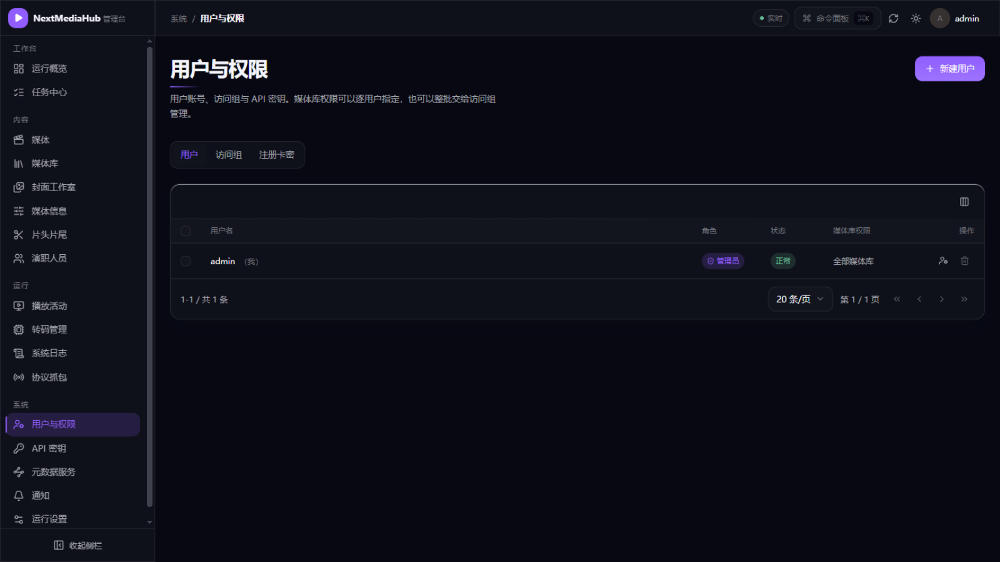
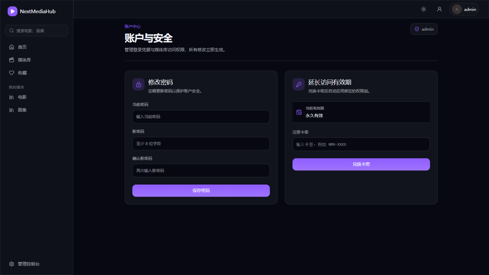
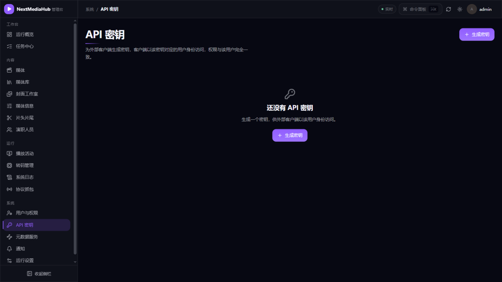

# 6. 用户与权限

[返回使用指南](README.md)

管理入口：**管理控制台 → 系统 → 用户与权限**。这里集中管理用户账号、访问组和注册卡密。

## 1. 新建用户

1. 点击右上角**新建用户**；
2. 填写用户名和初始密码（至少 8 位），保存；
3. 把用户名密码告诉家人，他们用网页或 Emby 客户端登录即可（见[客户端连接](02-首次使用.md#5-用-emby-客户端观看)）。

用户列表中每行可以：调整角色（管理员/普通用户）、停用账号、删除账号。**管理员能进管理控制台**，家人用普通用户即可。

## 2. 控制每个用户能看哪些库

默认新用户能看到全部媒体库。想限制（比如给孩子的账号只开放「动画片」库）：

- 在用户行点**媒体库权限**图标，勾选该用户可见的库；
- 用户多时用**访问组**：创建一个组并勾选库，把用户加入组即可批量生效。

改完立即生效，用户的首页只会出现有权访问的库。

## 3. 注册卡密（自助开户）

不想逐个建账号时，用**注册卡密**：

1. 切到「注册卡密」标签，生成若干卡密（当前兼容格式形如 `NMH-XXXX`）；
2. 把卡密发给使用者，他们在登录页点**注册新账户**，或登录后到「账户与安全」页输入卡密兑换/延长有效期：

已使用的卡密会标记状态，未用的可作废。

## 4. API 密钥（给第三方工具用）

**管理控制台 → 系统 → API 密钥**：

- 第三方工具（如 MoviePilot、自动化脚本）需要以 Emby 兼容方式访问服务器时，创建一个 API 密钥给它；
- 密钥只完整显示一次，妥善保存；支持**轮换**（换新密钥，旧密钥作废）。

## 下一步

- 账号开好了，看看服务器跑得怎么样 → [7. 任务与计划任务](07-任务与计划任务.md)
- 想从老 Emby 服务器整体搬用户和观看记录 → [10. Emby 数据导入](10-Emby数据导入.md)
