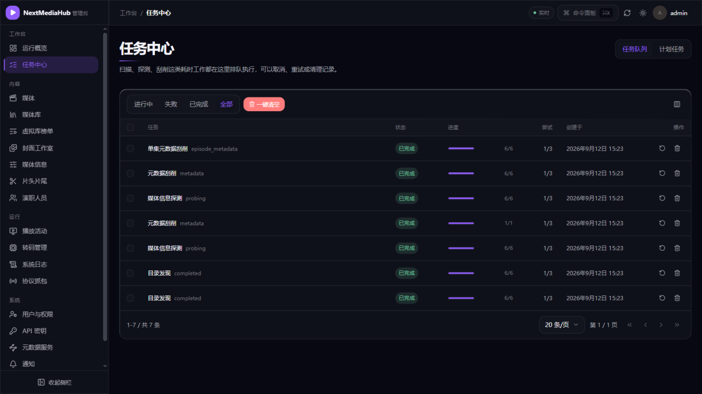
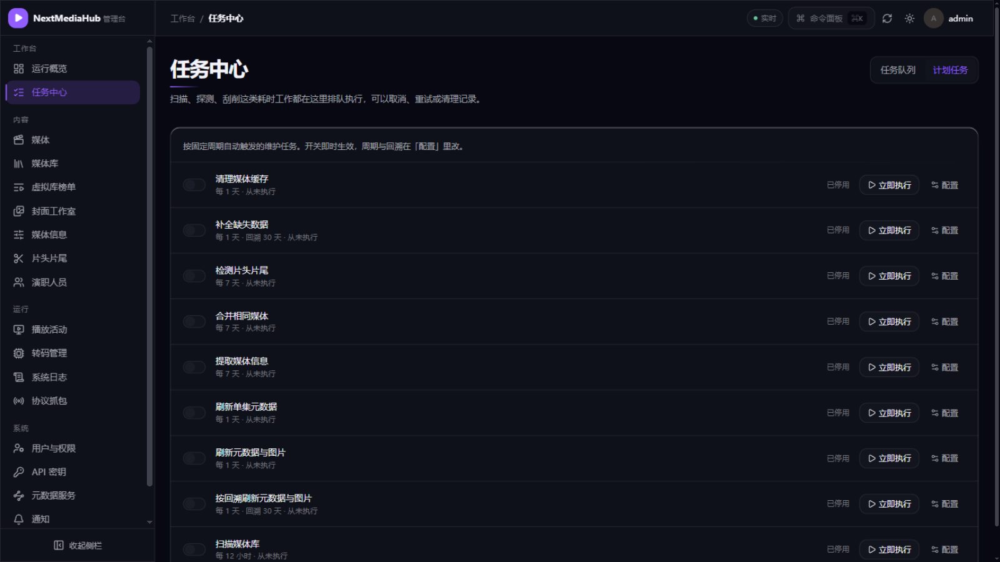

# 7. 任务与计划任务

[返回使用指南](README.md)

扫描、探测、刮削、封面生成等耗时工作会在后台排队执行，不会阻塞页面操作；关闭浏览器后任务仍会继续。管理入口：**管理控制台 → 工作台 → 任务中心**。

## 1. 任务中心：看进度、重试、取消

顶部「任务队列」标签展示所有后台任务：

- **状态筛选**：进行中 / 失败 / 已完成 / 全部；
- 每个任务显示类型、进度（如 6/6）、尝试次数和创建时间；
- 失败的任务点**重试**再跑一次；不需要的记录可删除，「一键清空」清理全部历史；
- 每个响应都有唯一请求编号，排查问题时可把日志与操作对应起来（见[日志与常见问题](09-日志与常见问题.md)）。

侧栏「任务中心」上的角标实时显示进行中的任务数，跑完自动消失。

## 2. 计划任务：定时自动维护

切到右上角「计划任务」标签：

每个任务一行，右侧三个操作：

| 操作 | 作用 |
| --- | --- |
| 开关 | 启用/停用该任务（**默认全部停用**，按需开启） |
| ▶ 立即执行 | 不等周期，马上跑一次 |
| 配置 | 调整执行间隔，或改为每天固定时刻 |

内置任务及默认周期（开启后生效）：

| 任务 | 默认周期 | 干什么 |
| --- | --- | --- |
| 扫描媒体库 | 每 12 小时 | 全量核对媒体文件夹，兜住监听漏掉的增删改 |
| 刷新元数据与图片 | 每天 | 重新拉取全部影片的海报简介 |
| 按回溯刷新元数据与图片 | 每天，回溯 30 天 | 只补近 30 天入库且缺图缺简介的 |
| 刷新单集元数据 | 每天 | 补全剧集缺失的单集简介和截图 |
| 提取媒体信息 | 每 7 天 | 补全分辨率、编码、音轨等技术信息 |
| 检测片头片尾 | 每 7 天 | 为开启检测的剧集分析片头片尾位置 |
| 补全缺失数据 | 每天，回溯 30 天 | 缺什么补什么（元数据/图片/截图/媒体信息） |
| 构建豆瓣元数据缓存 | 每 60 分钟 | 补充中文简介评分（需先启用豆瓣来源） |
| 合并相同媒体 | 每 7 天 | 同一部片子的多版本归到一起 |
| 清理媒体缓存 | 每天 | 清掉过期的转码切片和图片缓存 |

> **建议配置**：家庭库开「扫描媒体库」+「按回溯刷新元数据与图片」就够日常用；影片放在 NAS 上时务必开「扫描媒体库」作为兜底。

## 3. 概览页的「后台通道」

**工作台 → 运行概览**右侧的「后台通道」面板显示各类任务通道的实时状态（空闲/执行中、上次执行结果），不用进任务中心也能一眼看到服务器在忙什么：

## 下一步

- 任务失败怎么查原因 → [9. 日志与常见问题](09-日志与常见问题.md)
- 让维护任务自动跑 → 开启对应计划任务开关即可
