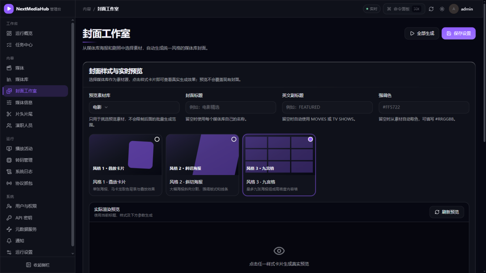
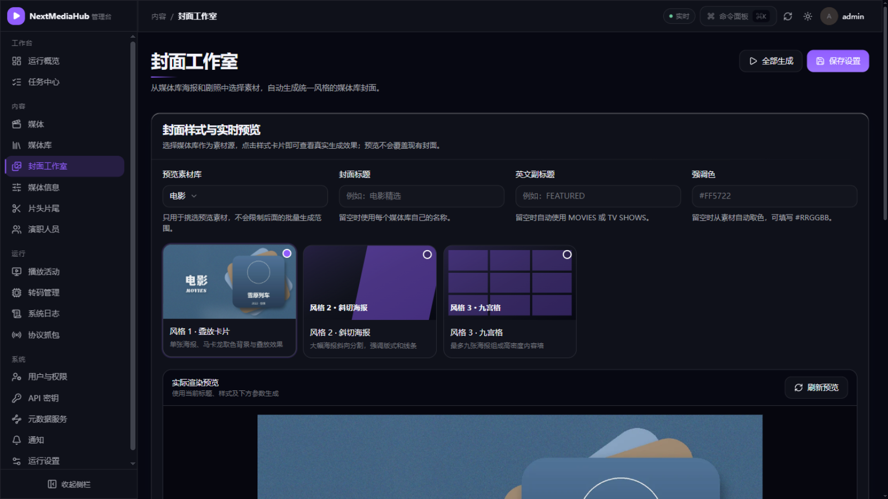
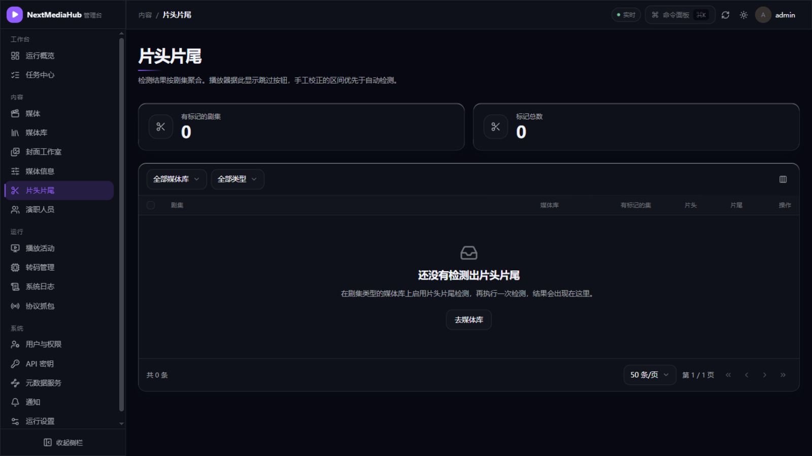
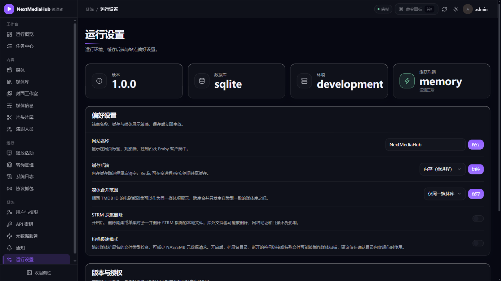

# 8. 特色功能

[返回使用指南](README.md)

## 1. 封面工作室：自动生成媒体库封面

给每个媒体库生成统一风格的精美封面（海报拼图），管理入口：**管理控制台 → 内容 → 封面工作室**。

操作流程：

1. **选样式**：点击任一风格卡片（叠放卡片 / 斜切海报 / 九宫格等），页面立即用你媒体库的真实海报渲染预览：

2. **调参数**：填封面标题（如「电影精选」）、英文副标题、强调色；展开高级设置可调尺寸、格式、模糊度和字体。
3. **选范围生成**：在「生成范围」勾选一个或多个媒体库，点**生成选中媒体库**；也可以直接**全部生成**。生成走后台任务，不阻塞页面。
4. **管理历史**：每次生成自动保存历史版本，可预览、一键恢复或删除旧封面。

想定时自动更新封面：到「任务中心 → 计划任务」里会有「生成媒体库封面」任务可开启。

> 容器部署且预览图中文乱码时，在高级设置里填一个中文字体文件的绝对路径（如 `/usr/share/fonts/opentype/noto/NotoSansCJK-Regular.ttc`）。

## 2. 跳过片头片尾

对剧集库开启检测后，播放时播放器会出现「跳过片头 / 跳过片尾」按钮，一键跳过重复的开场。

开启方法：

1. 前提：媒体库类型必须是**剧集**；
2. **管理控制台 → 内容 → 片头片尾**，为对应剧集/媒体库启动检测：

3. 触发检测：在片头片尾页手动发起，或开启「检测片头片尾」计划任务（默认每 7 天）。

检测原理是比对同一季各集的音频指纹找出重复片段，需要几集以上才有意义；检测完成后观看时即可看到跳过按钮。

## 3. 虚拟库榜单（需授权）

> 属于增值功能：在「运行设置 → 授权」中激活对应授权后才会出现在导航里。

虚拟库不对应磁盘文件夹，而是从 TMDB 榜单（热门、趋势等）自动抓取条目、匹配本地已有影片生成的「运营位」媒体库——适合做「本周热门」这类专题墙。榜单按设定间隔自动刷新，条目也可以手动编辑排序。

## 4. 用户求片（需授权）

> 属于增值功能，且需在部署配置中开启求片开关（`REQUEST_ENABLED=true`）。

开通后观影端出现「求片」页面：用户搜索想看的影片提交请求、给别人的请求投票；管理员在 **工作台 → 求片管理** 审批。可对接 MoviePilot 自动订阅下载，影片入库后自动闭环通知。每用户每月有默认配额（3 部），防止刷屏。

## 5. 通知 Webhook

**管理控制台 → 系统 → 通知**：添加 Webhook 地址（企业微信机器人、Bark、自建服务等），勾选要接收的事件类型，保存前可发送测试消息。此后入库、播放等事件会自动推送到你的渠道。

## 6. 运行设置与授权

**管理控制台 → 系统 → 运行设置** 集中了运行偏好：站点名称、缓存后端（内存/Redis 切换）、媒体合并范围、STRM 深度删除开关、扫描极速模式等，**保存后立即生效**，无需重启：

页面底部的「版本与授权」面板用于激活增值授权——虚拟库榜单、用户求片等功能激活后才会出现在导航中。

## 下一步

- 增值功能的授权激活入口在 → **管理控制台 → 系统 → 运行设置**
- 生成封面/检测片头的任务进度 → [7. 任务与计划任务](07-任务与计划任务.md)
