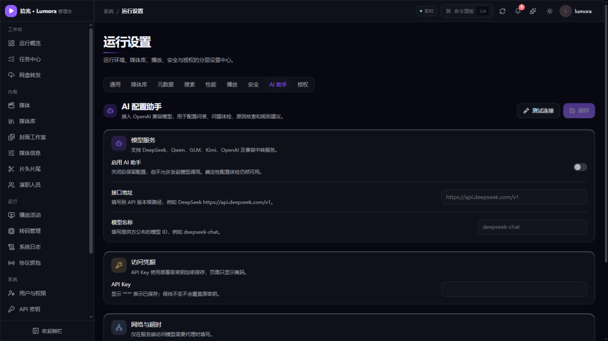
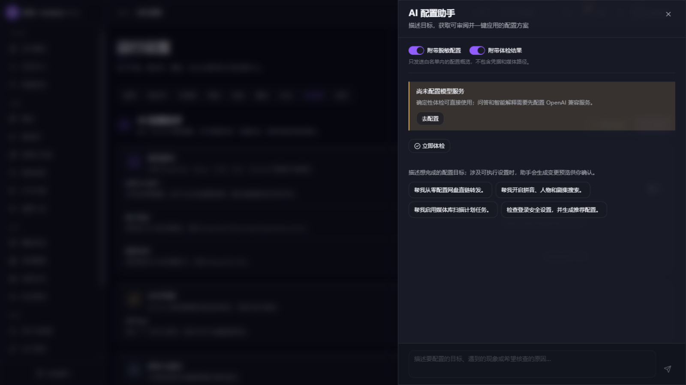
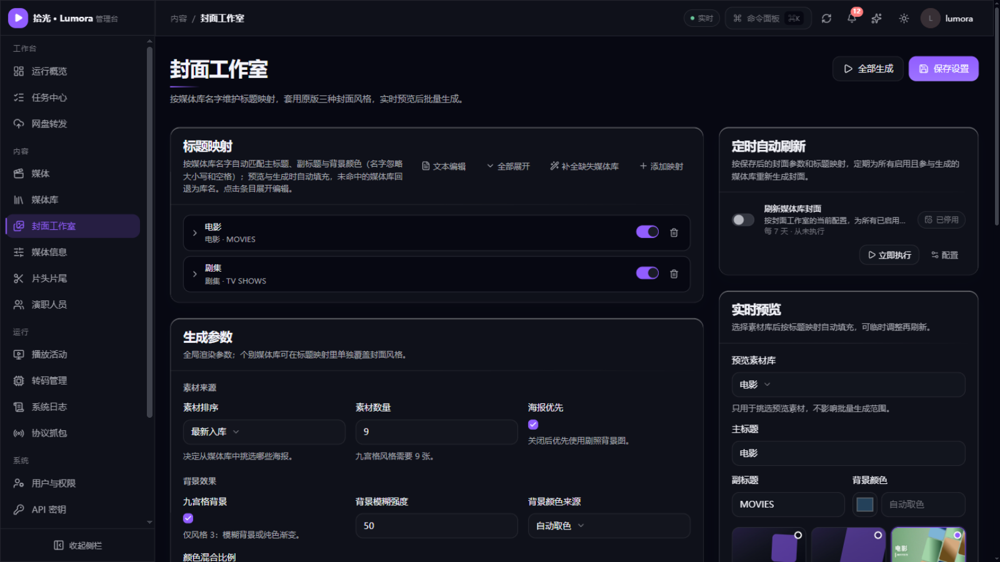
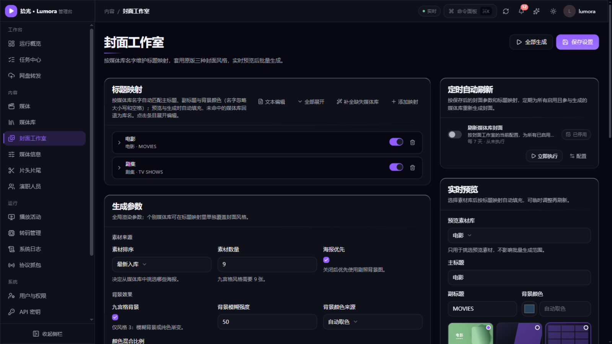
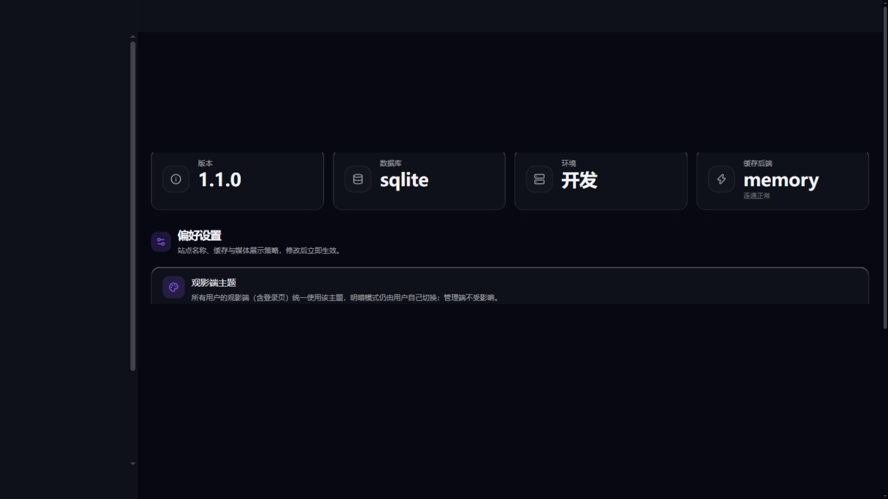

# 8. 特色功能

[返回使用指南](README.md)

## 1. AI 配置助手

接入一个 OpenAI 兼容的模型服务（DeepSeek、OpenAI、智谱 GLM、阿里百炼、自建中转均可），就能用自然语言咨询配置问题、检查配置冲突、解释故障原因，并生成**可审阅、可执行的配置提案**。默认关闭，按需启用。

> 安全边界：模型本身**不能直接写入系统**。每项提案都由服务端按白名单重新校验、展示变更前后值，并由管理员点击**应用**后才执行；API Key、SMTP 密码、Token 等密钥不会进入提案或提示词。

**第一步：配置模型服务**（**管理控制台 → 系统 → 运行设置 → AI 助手**）：

1. 填写接口地址（如 DeepSeek 填 `https://api.deepseek.com/v1`）、API Key 和模型名称（如 `deepseek-chat`）；
2. 保存后点**测试连接**，确认模型名称与响应耗时正常；
3. 开启**启用 AI 助手**。需要代理时可选填 http/https/socks5 代理，超时 10–300 秒可调。

推理模型的思考过程与正文共享「最大输出 Token」预算（默认 131072，最高可调到 1048576）；模型以 `finish_reason=length` 结束时，适当调高该值即可。API Key 使用部署级密钥 AES-GCM 加密保存，保存后页面只显示 `****`。

**第二步：提问与体检**。管理控制台顶栏的**星光图标**可随时打开助手抽屉，支持流式回复、折叠显示思考过程和停止生成。提问时可附带两类上下文：

- **附带脱敏配置**：运行设置、网盘策略与账号状态、媒体库概览等（字段白名单，不含凭据与媒体路径明文）；
- **附带体检结果**：内置规则发现的配置冲突与修正建议。

「**立即体检**」不调用外部模型，未配置 AI 也可使用：检查媒体库空路径、在线元数据源不可用、网盘无有效账号或识别方式、通知未订阅事件等常见问题，并给出调整入口。

**第三步：应用提案**。直接描述目标，例如「开启拼音、人物和剧集搜索」「检查登录安全设置并生成推荐配置」，助手会回复带**变更清单与风险提示**的操作卡片：

- 支持：批量修改运行设置与安全设置、启停计划任务、调整网盘账号角色、建立兜底映射、创建或删除匹配规则、修改网盘转发策略；
- 删除规则等敏感操作需要按页面要求额外确认；预览后被其他管理员改动过的配置，旧提案会被拒绝并要求重新生成；
- 应用只执行服务端校验过的白名单动作，不重复执行已应用的提案。

AI 还能帮两件网盘上的事，详见 [10. 网盘转发](10-网盘转发.md)：

- **网盘快速配置（三步首播）**：在抽屉内**连接网盘 → 选一部影片 → 开始播放**，从网盘目录、媒体库或粘贴样例开始；常见格式无需模型即可确定性识别，全程不跳转页面；
- **规则建议**：编辑匹配规则时用 **AI 智能填写**，一次提交多个样例路径，自动分组推导本地/远端前缀；建议生成后用「替换预览」和「试匹配」验证再保存。

> 隐私：对话记录仅保存在当前页面内存中，刷新即清空，不写入数据库或日志。用于智能识别的手动输入与样例会发送到所配置的模型服务。

## 2. 封面工作室：自动生成媒体库封面

给每个媒体库生成统一风格的精美封面（海报拼图），管理入口：**管理控制台 → 内容 → 封面工作室**。

操作流程：

1. **选样式**：点击任一风格卡片（叠放卡片 / 斜切海报 / 九宫格等），页面立即用你媒体库的真实海报渲染预览：

2. **调参数**：填封面标题（如「电影精选」）、英文副标题、强调色；在「标题与字体」区可以上传自定义字体（TTF/OTF/TTC/WOFF/WOFF2，单文件 ≤ 30 MiB），上传后从主/副标题字体下拉选择；展开高级设置可调尺寸、格式、模糊度等。
3. **选范围生成**：在「生成范围」勾选一个或多个媒体库，点**生成选中媒体库**；也可以直接**全部生成**。生成走后台任务，不阻塞页面。
4. **开启自动刷新**：在右侧「定时自动刷新」中打开开关，可按间隔、每天、每周、每月或自定义 Cron 配置；任务会按已保存的参数刷新所有参与生成的媒体库，也可点**立即执行**手动触发。
5. **管理历史**：每次生成自动保存历史版本，可预览、一键恢复或删除旧封面。

> 容器部署且预览图中文乱码时，上传一个中文字体即可；也可以不走上传接口，直接把字体文件放进挂载卷的 `instance/covers-fonts/` 目录，刷新页面即可在下拉中看到（展示名取文件名）。

## 3. 跳过片头片尾

对剧集库开启检测后，播放时播放器会出现「跳过片头 / 跳过片尾」按钮，一键跳过重复的开场。

开启方法：

1. 前提：媒体库类型必须是**剧集**；
2. **管理控制台 → 内容 → 片头片尾**，为对应剧集/媒体库启动检测：

3. 触发检测：在片头片尾页手动发起，或开启「检测片头片尾」计划任务（默认每 7 天）。

检测原理是比对同一季各集的音频指纹找出重复片段，需要几集以上才有意义；如果文件自带命名规范（OP/ED、片头/片尾、Intro/Credits）且位置时长合理的章节，会直接采用章节信息，不再额外探测。追剧新增单集时走增量检测：复用已有结果和本地声纹缓存，只读取需要分析的片段，通常几分钟即可完成，几乎不产生网盘读取流量；检测完成后观看时即可看到跳过按钮。

## 4. 虚拟库榜单（需授权）

> 属于增值功能：在「运行设置 → 授权」中激活对应授权后才会出现在导航里。

虚拟库不对应磁盘文件夹，而是从 TMDB 榜单（热门、趋势等）自动抓取条目、匹配本地已有影片生成的「运营位」媒体库——适合做「本周热门」这类专题墙。榜单按设定间隔自动刷新，条目也可以手动编辑排序。

## 5. 用户求片（需授权）

> 属于增值功能，且需在部署配置中开启求片开关（`REQUEST_ENABLED=true`）。

开通后观影端出现「求片」页面：用户搜索想看的影片提交请求、给别人的请求投票；管理员在 **工作台 → 求片管理** 审批。可对接 MoviePilot 自动订阅下载，影片入库后自动闭环通知。每用户每月有默认配额（3 部），防止刷屏。

## 6. 节点共享（需授权）

> 属于 PRO / MAX 增值功能。仅适用于互相信任的拾光实例；默认不对外提供或接收共享结果，也不会自动连接其他实例。

在 **管理控制台 → 内容 → 节点共享**，可以共享媒体技术信息和片头片尾检测结果，减少多个实例对同一文件的重复探测。这里共享的是探测结果，**不是影片文件或播放地址**。

1. 在接收方的「访问密钥」中创建密钥，按用途选择读取或汇报权限；明文仅显示一次，立即安全保存并交给对端管理员。主动汇报需要绑定发送节点的「本节点身份」ID。
2. 在「接收与共享」中按需开启对外查询或接收主动汇报，并选择允许查询的资源。
3. 在另一实例的「远端节点」中添加对端地址及密钥，测试连接，再按需开启查询或主动汇报。公网节点使用 HTTPS；只有确实在可信内网直连时才允许私网/回环地址。可限定汇报的媒体库与资源范围。
4. 已有结果需要补报时，在「汇报队列」发起**历史补报**；失败投递可查看状态并重试死信。

关闭授权后，节点配置和记录会保留，但共享接口及后台查询、投递会暂停，恢复权益后可继续使用。

## 7. 通知 Webhook

**管理控制台 → 系统 → 通知**：添加 Webhook 地址（企业微信机器人、Bark、自建服务等），勾选要接收的事件类型，保存前可发送测试消息。此后入库、播放等事件会自动推送到你的渠道。

## 8. 运行设置与授权

**管理控制台 → 系统 → 运行设置** 按页签分组集中了运行偏好：**通用**（站点名称、缓存后端、媒体合并范围、STRM 深度删除、扫描极速模式）、**媒体库**、**元数据**（补全规则）、**搜索**（拼音/人物/单集搜索开关）、**性能**（媒体信息探测并发与各类 QPS 限速）、**播放**、**安全**、**AI 助手**，**保存后立即生效**，无需重启：

「授权」页签中的「版本与授权」面板用于激活增值授权——虚拟库榜单、用户求片、节点共享等功能激活后才会出现在导航中。

## 下一步

- 增值功能的授权激活入口在 → **管理控制台 → 系统 → 运行设置 → 授权**
- 生成封面/检测片头的任务进度 → [7. 任务与计划任务](07-任务与计划任务.md)
- 网盘直链播放与 AI 辅助配置 → [10. 网盘转发](10-网盘转发.md)
