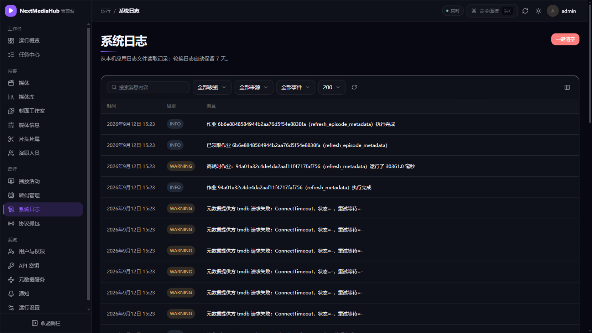
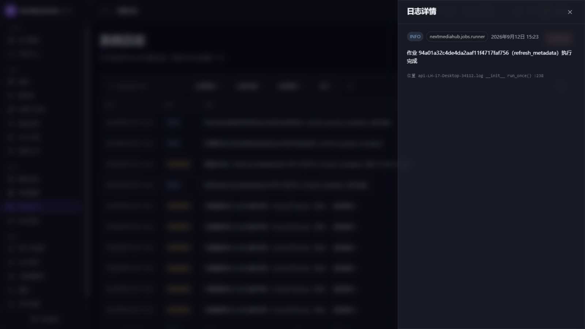
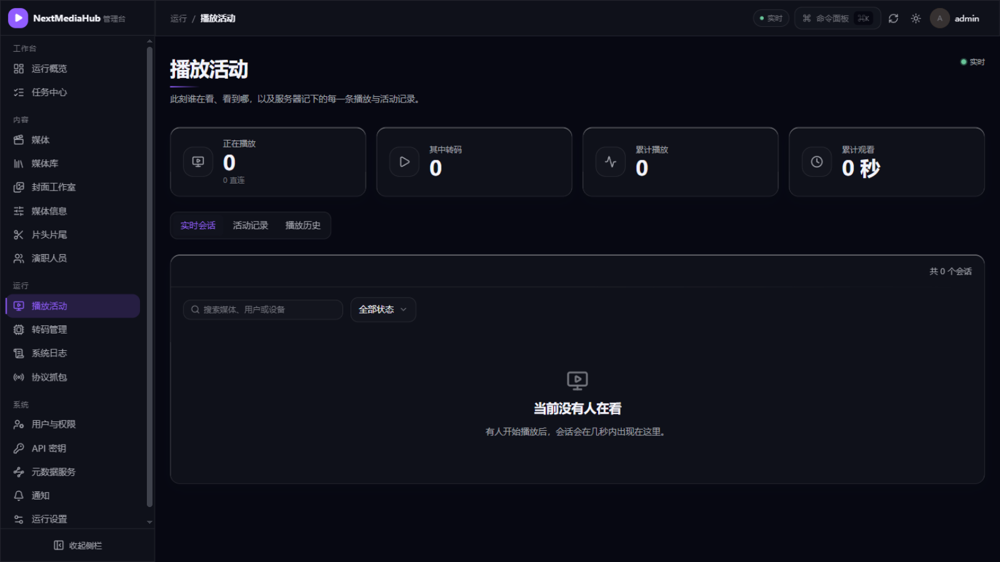

# 9. 日志与常见问题

[← 返回目录](README.md)

## 1. 去哪看日志

**管理控制台 → 运行 → 系统日志**：网页里直接筛选查看，不用登服务器：

- 按级别（INFO/WARNING/ERROR）、来源、关键字筛选；
- 点任意一条打开**日志详情**，查看完整内容：

日志同时落盘在 `logs/` 目录（每个文件 10 MiB 自动轮转，保留 5 份），Docker 部署也可以 `docker compose logs app` 查看。

**排查小技巧**：反馈问题时，让使用者按 F12 打开浏览器开发者工具，在出错请求的响应头里找到请求编号（`X-Request-Id`），拿这个编号到日志里一筛，就能精确定位那一次操作的全部记录。

## 2. 谁在看、看了什么

**管理控制台 → 运行 → 播放活动**：

- **实时会话**：此刻谁在看、用什么设备、是否在转码（有人在看时几秒内出现）；
- **活动记录 / 播放历史**：回溯每一次播放；
- 顶部卡片汇总正在播放数、转码数、累计播放与观看时长。

「卡顿是不是他在转码？」这类问题先来这里看。

## 3. 服务器健康吗

不需要登录也能快速确认：

- 浏览器打开 `http://服务器地址:18096/healthz` —— 返回正常内容即服务存活；
- 管理控制台顶部的「实时」绿点 —— 表示实时推送连接正常，页面数据自动刷新。

## 4. 常见问题

### 打不开 / 连不上

| 现象 | 处理 |
| --- | --- |
| 页面完全打不开 | `docker compose ps` 看容器是否健康；`docker compose logs app` 找报错 |
| Emby 客户端连不上 | 确认地址带了 `http://` 和端口；服务器防火墙放行 18096 |
| 刚启动页面慢 | 等半分钟，后台组件错峰启动后再试 |

### 媒体库与扫描

| 现象 | 处理 |
| --- | --- |
| 建好库但里面没内容 | 去**任务中心**看扫描任务是否完成；确认填的是**服务器上**的路径，不是你自己电脑的路径 |
| NAS 上的新文件没自动入库 | 网络盘可能收不到文件变化通知，开启「扫描媒体库」计划任务兜底，或部署时开轮询（见[媒体库管理](03-媒体库管理.md#5-网络盘nas-注意事项)） |
| 删了文件库里还在 | 等下次扫描同步，或手动点库卡片的「扫描」 |
| 扫描突然变慢/库暂时不可用 | 网络盘响应超时触发了自动熔断保护，默认半小时后自动恢复；把库的「自动处理并发数」调低可减少复发 |

### 海报与简介

| 现象 | 处理 |
| --- | --- |
| 全都没有海报 | 「元数据服务」里点**测试连通**检查 TMDB 是否可达；不通就配镜像或代理 |
| 个别影片匹配错 | 详情页 → 重新识别（见[手动识别](04-元数据刮削.md#3-识别错了怎么办手动识别)） |
| 想要中文简介评分 | 启用豆瓣来源 + 开「构建豆瓣元数据缓存」计划任务（见[启用豆瓣](04-元数据刮削.md#4-启用豆瓣中文增强)） |

### 播放

| 现象 | 处理 |
| --- | --- |
| 能看列表不能播放 | 多为格式浏览器不支持：确认播放页选择了转码档位；检查该用户是否被限制转码 |
| 卡顿 | **运行 → 转码管理** 看是否已到并发上限；多人看同一部片会命中缓存不重复转码 |
| 远程 `.strm` 文件播放超时 | 源站响应慢，播放走的是服务器转发；先在源站测速确认 |

### 账号

| 现象 | 处理 |
| --- | --- |
| 忘记管理员密码 | 让其他管理员改；没有其他管理员时删除数据目录中的用户数据库并重走安装向导（会丢用户数据，先备份咨询社区） |
| 用户看不到某个库 | 检查该用户的媒体库权限/访问组（见[用户与权限](06-用户与权限.md#2-控制每个用户能看哪些库)） |
| 求片/虚拟库菜单不见了 | 这两个是授权功能，检查「运行设置 → 授权」状态 |

## 5. 还是不行？

- 搜索项目 issue：仓库 GitHub Issues；
- 提问时附上：日志页按错误级别筛选后的截图 + 操作时间点 + 复现步骤。
