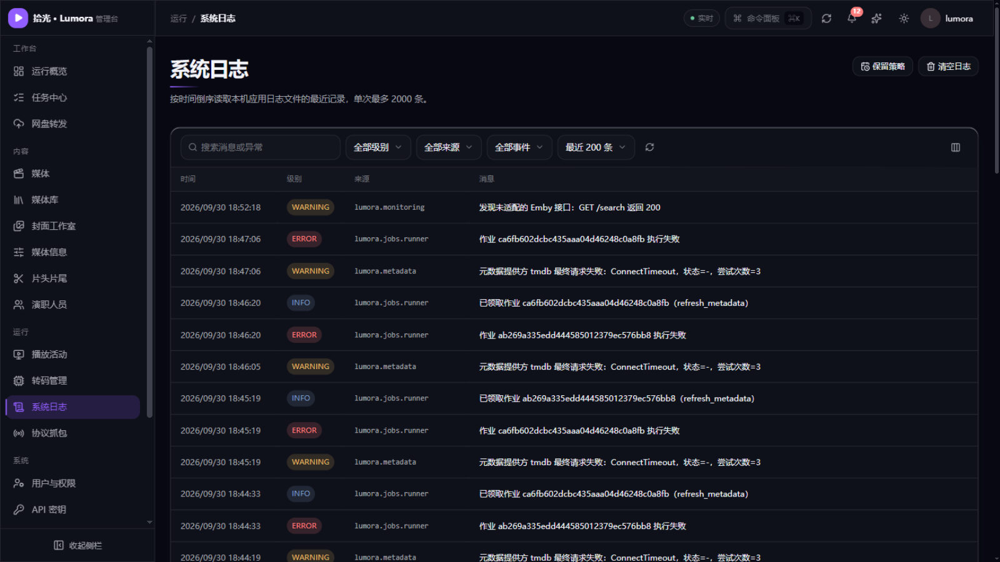
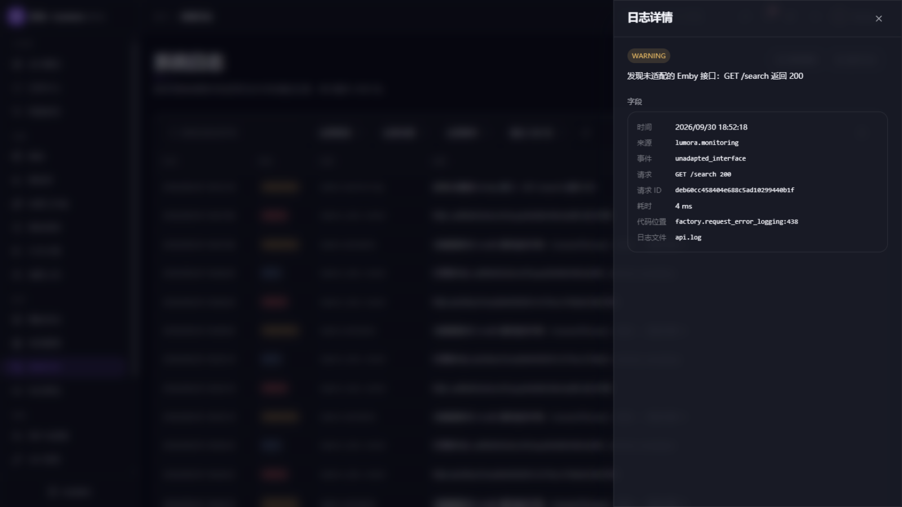
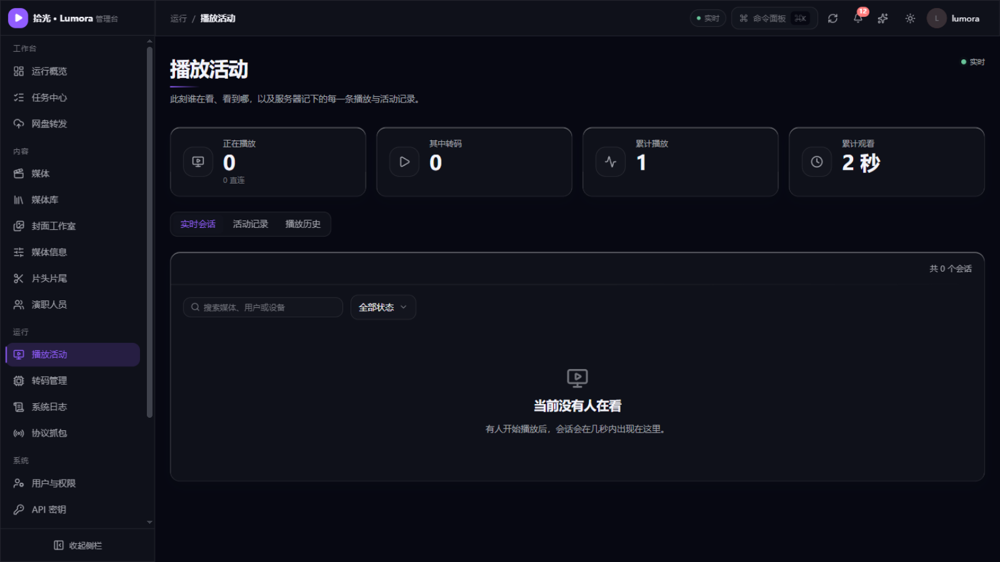

# 9. 日志与常见问题

[返回使用指南](README.md)

## 1. 去哪看日志

**管理控制台 → 运行 → 系统日志**：网页里直接筛选查看，不用登服务器：

- 按级别（INFO/WARNING/ERROR）、来源、关键字筛选；
- 点任意一条打开**日志详情**，查看完整内容：

日志同时落盘在 `logs/` 目录（每个文件 10 MiB 自动轮转，保留 5 份），Docker 部署也可以 `docker compose logs app` 查看。

**排查小技巧**：反馈问题时，让使用者按 F12 打开浏览器开发者工具，在出错请求的响应头里找到请求编号（`X-Request-Id`），拿这个编号到日志里一筛，就能精确定位那一次操作的全部记录。

## 2. 谁在看、看了什么

**管理控制台 → 运行 → 播放活动**：

- **实时会话**：此刻谁在看、用什么设备、是否在转码（有人在看时几秒内出现）；
- **活动记录 / 播放历史**：回溯每一次播放；
- 顶部卡片汇总正在播放数、转码数、累计播放与观看时长。

「卡顿是不是他在转码？」这类问题先来这里看。

## 3. 服务器健康吗

不需要登录也能快速确认：

- 浏览器打开 `http://服务器地址:18096/healthz`，返回 HTTP 200 表示服务存活；
- 管理控制台顶部的「实时」绿点 —— 表示实时推送连接正常，页面数据自动刷新。

## 4. 常见问题

### 打不开 / 连不上

| 现象 | 处理 |
| --- | --- |
| 页面完全打不开 | `docker compose ps` 看容器是否健康；`docker compose logs app` 找报错 |
| Emby 客户端连不上 | 确认地址带了 `http://` 和端口；服务器防火墙放行 18096 |
| 刚启动页面慢 | 等半分钟，后台组件错峰启动后再试 |

### 媒体库与扫描

| 现象 | 处理 |
| --- | --- |
| 建好库但里面没内容 | 去**任务中心**看扫描任务是否完成；确认填的是**服务器上**的路径，不是你自己电脑的路径；识别失败的条目默认不在观影端显示，到**管理控制台 → 内容 → 媒体**看是否有未识别条目，补全识别后自然出现 |
| NAS 上的新文件没自动入库 | 系统会自动识别网络挂载并在需要时降级为兼容轮询，仍建议开启「全库扫描」计划任务兜底（见[媒体库管理](03-媒体库管理.md#5-网络盘nas注意事项)） |
| 删了文件库里还在 | 等下次扫描同步，或手动点库卡片的「扫描」 |
| 扫描突然变慢/库暂时不可用 | 网络盘响应超时触发了自动熔断保护，默认半小时后自动恢复；在「运行设置 → 性能」中把媒体信息或片头片尾 QPS 调低可减少复发 |

### 海报与简介

| 现象 | 处理 |
| --- | --- |
| 全都没有海报 | 「元数据服务」里点**测试连通**检查 TMDB 是否可达；不通就配镜像或代理 |
| TMDB ID 正确但仍有少量漏刮 | 常见原因是请求过密、镜像或代理偶发失败；把「运行设置 → 性能」里的元数据请求 QPS 调到 1～2，保存后运行中的任务会在下一批次热加载配置，再重试失败项目 |
| 简介正常但海报、背景图或头像漏下 | 在「运行设置 → 性能」中单独调低图片下载 QPS；该设置不影响元数据请求和媒体分析 |
| 个别影片匹配错 | 详情页 → 重新识别（见[手动识别](04-元数据刮削.md#4-识别错了怎么办手动识别)） |
| 想要中文简介评分 | 启用豆瓣来源 + 开「豆瓣缓存构建」计划任务（见[启用豆瓣](04-元数据刮削.md#5-启用豆瓣中文增强)） |

### 播放

| 现象 | 处理 |
| --- | --- |
| 能看列表不能播放 | 多为格式浏览器不支持：确认播放页选择了转码档位；检查该用户是否被限制转码 |
| 卡顿 | **运行 → 转码管理** 看是否已到并发上限；多人看同一部片会命中缓存不重复转码 |
| HDR / 杜比视界片源播放发绿、发紫 | 在起播页选择转码档位：转码会自动做 HDR → SDR 色调映射（杜比视界应用其动态元数据），HDR10／HLG 优先尝试 Vulkan，不可用时可回退 CPU；杜比视界仍需 `libplacebo` 与可用 Vulkan 环境。官方镜像带配套依赖，无独立显卡时也可能使用软件渲染，速度取决于 CPU |
| 转码报 Vulkan / libplacebo 相关错误 | 使用自定义 FFmpeg 的部署需自带 `libplacebo` 支持和可用 Vulkan 运行时；能力不足时会明确报错而非输出偏色画面，可改回内置媒体工具 |
| 自动画质或远距离跳转提示缺少时长 | 先在媒体信息页补全该影片的探测信息，再重试；同时确认用户有转码权限并启用了可用档位 |
| 网盘分析失败但播放正常 | 检查是否指定了媒体分析账号；指定后分析仅使用该账号，请恢复其登录或改选能访问片源的账号，未指定时才使用主号 |
| 远程 `.strm` 文件播放超时 | 源站响应慢，播放走的是服务器转发；先在源站测速确认；网盘 STRM 的直链播放见[网盘转发](10-网盘转发.md) |

### AI 助手

| 现象 | 处理 |
| --- | --- |
| 没配置模型，AI 相关功能能用吗 | 能：「立即体检」、样例格式识别、三步首播的确定性推导都不依赖模型；自然语言问答、未知格式的 AI 辅助识别和通知模板的 AI 批量生成需要接入模型服务 |
| 连接测试返回 401 / 403 | 检查 API Key 与模型访问权限，以及中转服务是否要求不同的认证方式 |
| 连接测试超时 | 检查服务器到模型接口的网络与代理地址；超时可在 10～300 秒范围内调整 |
| 回复显示被截断（finish_reason=length） | 在「运行设置 → AI 助手」调高「最大输出 Token」，推理模型的思考过程与正文共享该预算 |
| 对话记录刷新页面后没了 | 属正常设计：对话记录仅保存在当前页面内存，不写入数据库或日志 |
| 体检结果和 AI 说法冲突 | 体检来自当前数据库的确定性规则，应以体检为准；AI 只用于解释和补充核查步骤 |

### 账号

| 现象 | 处理 |
| --- | --- |
| 忘记管理员密码 | 让其他管理员重置；没有其他管理员时，先完整备份应用和数据库数据，再查阅当前版本的账号恢复说明或携带版本号与日志向项目社区求助。不要直接删除数据库文件 |
| 用户看不到某个库 | 检查该用户的媒体库权限/访问组（见[用户与权限](06-用户与权限.md#2-控制每个用户能看哪些库)） |
| 怀疑有人乱试密码 / 想封禁某个 IP | **系统 → 安全中心**看登录日志和封禁列表，可手动封禁或解封；自动封禁阈值在「运行设置 → 安全」调整（见[安全中心](06-用户与权限.md#5-安全中心登录审计与-ip-封禁)） |
| 求片/虚拟库菜单不见了 | 这两个是授权功能，检查「运行设置 → 授权」状态 |

## 5. 还是不行？

- 搜索项目 issue：仓库 GitHub Issues；
- 提问时附上：日志页按错误级别筛选后的截图 + 操作时间点 + 复现步骤。
