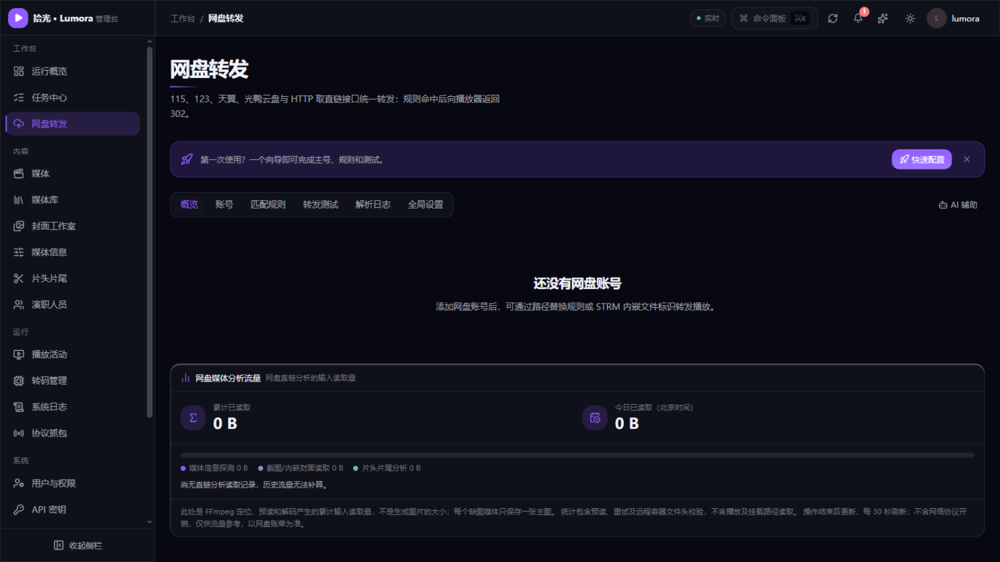

# 10. 网盘转发（115 / 123 / 天翼 / 光鸭直链播放）

[返回使用指南](README.md)

> 网盘转发让 STRM 媒体库或本地路径媒体通过网盘 302 直链播放：播放流量直接从网盘 CDN 到播放器，不消耗服务器上行带宽。管理入口：**管理控制台 → 工作台 → 网盘转发**（页签：概览、账号、匹配规则、转发测试、解析日志、全局设置）。本文面向管理员与普通用户。

## 1. 两条快速路径

第一次配置网盘转发，推荐从向导开始，不必先啃完本页：

- **「快速配置」向导**：网盘转发页在还没有任何平台账号时会显示快速配置横幅，点开后在同一抽屉里连续完成**主号 → 小号（可选）→ 匹配规则（可选）→ 转发测试**，已有账号可直接复用。
- **AI 助手里的网盘快速配置**：在 [AI 配置助手](08-特色功能.md#1-ai-配置助手)抽屉里描述「我想让网盘的影片能直接播放」，即可走**连接网盘 → 选一部影片 → 开始播放**三步：选片可从网盘目录、媒体库搜索或粘贴样例开始，应用前预览将生成的账号角色、映射与规则，确认后自动测试主号和小号解析并试播。常见格式（本地/包装路径、115/123 标识、天翼秒传信息等）无需配置模型即可直接识别，只有未知格式才需要 AI 辅助。

配置完成后，日常增删账号、规则仍在 **管理控制台 → 工作台 → 网盘转发** 中维护。

## 2. 三层配置梯度（多数人只需第 0 层）

| 层 | 你要做什么 | 适用场景 |
| --- | --- | --- |
| **L0 零配置** | 什么都不填 | STRM 专用协议前缀、路径包含 `/cd2/strm/` 的 Tdr-302 链接 `…/cd2/strm/…/{etag}/{size}/{s3key}/{文件名}`，或光鸭 `/playgy/{文件ID}/{GCID}/{大小}/{文件名}` 链接 |
| **L1 简单模式** | 「本地路径前缀 + 网盘路径」两个字段 | 本地路径挂的是网盘同步目录、需要换成直链的场景 |
| **L2 高级模式** | 自定义正则 / 门控 / 用户范围 | 特殊 STRM 生成器、进阶用户（默认折叠，看不到正则） |

内置识别要求明确的协议或路径门控；**天翼 JSON、天翼链接及其他格式需显式配置规则，本地路径媒体使用路径替换。**

## 3. 管理员快速开始

1. **添加账号**（网盘转发 → 账号 → 添加账号）
   - 115：OpenAPI 扫码（推荐）或导入 refresh_token
   - 123：账号密码 / 开放平台 client_credentials / 扫码
   - 189（天翼云盘）：账号密码（要求图形验证码时向导内会显示）/ 扫码。会话失效时依次用 accessToken、refreshToken 自动续期，扫码账号无需频繁重扫；refreshToken 也失效后，账密账号自动重登，扫码账号需重新扫码。账密登录报「图形验证码错误」时会立刻换一张新验证码；后台重登遇到验证码时账号标记失效，在账号卡片点**重新登录**输入验证码即可恢复（无需删号重建）
   - 光鸭：扫码或导入 refresh_token，支持路径取链与小号秒传；账号失效后可在账号卡片重新登录
   - 向导最后一步选角色：**主号**（提供文件与元数据）/ **小号**（承接秒传取链，分担主号风控压力），并设置转存缓存目录（默认网盘根目录）
2. **建匹配规则**（仅 L1 场景需要）：本地路径前缀（如 `/media/movies`）→ 网盘真实路径（如 `/媒体库/电影`）。可先用**试匹配**粘贴样例验证；开启 AI 助手后还可用 **AI 智能填写**一次提交多个样例路径，自动分组给出前缀建议（详见 [AI 配置助手](08-特色功能.md#1-ai-配置助手)）
3. **转发测试**（网盘转发 → 转发测试）：粘贴 STRM 内容或本地路径 →
   - **试匹配**：只跑规则，不调网盘，改规则即时预览
   - **302 全链路**：完整解析并给出最终直链，可 HEAD 探活（选 UA，验证 115 直链的 UA 绑定——播放器改 UA 导致 403 是最高频问题）
   - **小号秒传**：强制走指定小号验证秒传链路，测试产生的临时文件自动清理
4. **看日志**（网盘转发 → 解析日志）：查每次播放的命中规则、所用账号、来源（主号/小号/用户自有/inline/缓存）、成败原因码与耗时

## 4. 天翼云盘（189）的两种模式

- **路径模式**（所有版本可用）：主号 + 路径替换规则（本地路径前缀 → 天翼云盘真实路径），播放时主号直接取 302 直链。天翼直链不与 UA 绑定。
- **秒传模式**（**增值服务**，PRO 及以上授权）：把文件按 MD5 分片信息「秒传」到小号/用户自有账号后由其承接播放流量，主号零下载消耗。秒传信息为 `md5`、`size`、`slice_md5`、`slice_size` 四项（可用 Tdr-189 秒传提取工具生成）：天翼 JSON 和秒传链接不再内置自动识别；须创建显式「秒传信息」规则，为四项各配一条单捕获组正则（文件名可选），并配置来源门控。路径模式下主号→小号秒传时列表只带 md5，驱动回退旧版 createUploadFile 接口（只需 md5 + size）。授权不包含该功能时：规则编辑器隐藏「秒传信息」选项，播放链路以 `premium_required` 拒绝。

## 5. 小号与用户映射

把指定用户的播放改由**小号**秒传取链，主号零取链压力：

- 小号映射 = 小号账号 + 用户列表；兜底映射在专属映射未命中时生效
- 小号或兼任账号均可配置兜底；兼任账号显式映射后可承担播放，纯主号在「中止」策略下仍不可用于播放
- 直链模式下，后台媒体分析优先使用指定的媒体分析账号，未指定时使用主号，不要求配置用户小号映射。分析与播放分别缓存，修改映射后不会复用原候选账号的失败缓存
- 网盘来源解析失败时，探测列表显示账号不可用、秒传信息不完整等具体分类；修复配置后可对失败条目手动重新探测
- 小号秒传会在小号网盘的「转存缓存目录」产生临时文件，按保留时长（默认 24h，全局设置可调）自动清理并清空回收站，也可在账号操作里手动处理

## 6. 失败策略与「防跑上行」

规则按配置顺序尝试：规则 1 命中但文件查询、秒传或获取直链失败时，继续匹配规则 2 及后续规则；取到直链即停止。未命中或不在当前用户范围内的规则会跳过。自定义规则均未成功时，若已开启内置识别器，则最后尝试内置识别。所有候选均失败后，才执行下表的失败策略；整个播放解析共用 15 秒总预算。

每条规则仍须遵守账号绑定和小号播放限制。强制绑定模式下未绑定账号会直接拒绝；小号策略中止后可以尝试后续规则，但全部失败时仍拒绝播放，避免降级为服务器中转。这里的自动续试发生在服务端解析阶段；已经向播放器返回 302 后，播放器访问 CDN 产生的错误不会反馈给本次解析，无法据此自动切换规则。

家宽部署最怕解析失败后全量流量悄悄走服务器上行打满带宽。全局设置里：

| 设置 | 默认 | 语义 |
| --- | --- | --- |
| 转发失败策略 | **仅本地** | 命中网盘但解析失败：本地文件真实存在才降级本地播放，否则 502 附原因码；302 直链是网盘内容唯一出网路径 |
| 未命中 STRM 策略 | 允许中转 | STRM 未被网盘规则命中时是否允许服务器中转；改为「拒绝」可防规则漏配后全量流量走上行 |
| 小号失败策略 | **中止** | 小号秒传失败不回退主号，保护上游账号（对齐 emby-302 语义） |

## 7. 用户自有账号（可选开启）

管理员在全局设置中按网盘开启三态模式：

- **关闭**（默认）：用户侧不可见
- **可选**：用户在「账户中心 → 我的网盘账号」绑定自己的 115 / 123 / 天翼 / 光鸭账号，本人播放优先走自己的账号秒传——管理员主号与平台小号零流量消耗
- **强制**：未绑定自有账号的用户不能播放网盘内容（管理员豁免），公网共享部署的理想模式

用户绑定方式：115 扫码；123 扫码或账号密码（密码绑定有频控：每分钟 5 次，连续失败锁定 15 分钟）；天翼云盘支持扫码或账号密码，要求图形验证码时在弹窗内填写。管理员在网盘设置中将「用户自有天翼云盘账号」设为可选或强制，并确保实例具有天翼秒传授权。光鸭支持扫码或导入刷新令牌。首次绑定时先验证凭据，再选择转存缓存目录并确认，四种网盘均可浏览并直接新建目录；同账号重新登录可保留原目录直接恢复。天翼账号仅用于所属用户的秒传与播放，支持重新扫码或账密重登。

用户可随时解绑（解绑前自动清理写入其网盘的全部转存临时文件），也可在账户页查看并手动清理「我的网盘中被写入的临时文件」。删除失败时保留账号与临时文件登记，页面会提示失败，修复账号后可重试清理或解绑。

账号失效后无需先用失效凭据清理才能恢复登录。用户侧重新扫码或验证凭据后，确认是同一网盘账号就会自动完成重登，保留原保存目录、缓存登记和未完成的清理进度，无需再次选择目录或放弃缓存。只有更换网盘账号或原身份无法核验且存在旧缓存时，才需要明确确认移除旧登记；该选项默认不勾选，只清除本地登记，不会删除旧网盘中的文件，遗留临时文件需自行登录网盘清理。光鸭管理端的换绑确认可复用本次扫码授权，无需再扫一次。

> 隐私：凭据仅用于该用户本人播放的秒传与取链，不会用于其他用户。

## 8. 媒体分析流量统计

**指定分析账号（1.1.1 起）**：在「网盘转发 → 账号 → 编辑账号」开启“媒体分析账号”，每种网盘可指定一个平台账号；指定新账号时会自动替换旧指定。该设置仅在媒体分析读取方式为“网盘直链”时生效，用于探测、截图／内嵌封面和片头片尾分析，不改变用户的播放账号选择。

指定后，后台分析仅使用该账号，忽略主号／小号角色、用户映射与规则绑定账号；请确认它能访问待分析文件。未指定时使用主号；指定账号失效或不可用时分析会失败，需要恢复登录或调整指定账号，不会自动换用主号。

网盘转发 → 概览中的「网盘媒体分析流量」卡片展示后台媒体分析从网盘读取的流量：累计与今日读取量（按北京时间零点划分），并按用途区分**媒体信息探测**、**截图与内嵌封面读取**、**片头片尾分析**三类占比，30 秒自动刷新。

统计基于 FFprobe/FFmpeg 实际读取的字节，包含预读、重试和远程容器文件头校验，不含播放与挂载路径读取，也不含网络协议开销；仅统计经网盘规则成功解析的后台分析读取。历史流量无法补算，超时或中断可能造成统计不完整，计费请以网盘账单为准。

## 9. 账号健康与运维

- 账号失效（token 刷新失败等）自动标记并出现在概览页告警；115 支持手动**刷新令牌**
- 账号连续失败触发熔断（60 秒内 5 次），熔断期内快速失败不再打网盘，60 秒后自动恢复
- 后台每日任务「清理网盘转存缓存」：临时文件 TTL 清理 + 回收站清空 + 解析日志裁剪；服务重启时补删遗留
- 回收站按账号分别清理，包含平台小号与用户自有账号；即使没有新的过期临时文件，每日维护仍会重试回收站清空
- 天翼空间不足时自动清理：非根缓存目录有至少 100 个待清理文件、且目录内全部为本次可清理的已登记文件时，自动删除该目录并在原父目录下重建同名目录，再保存新目录 ID；清理后重试一次秒传。根目录、有未过期文件、未登记文件或子文件夹时，回退为每批最多 100 个文件的普通删除
- 快速重建与秒传串行执行；重建中断会保留断点，下次清理或秒传前继续恢复。重建后的旧目录按 ID 从回收站彻底删除。修改目录或账号配置时若有未完成重建，会提示先完成清理
- 一次维护会分批处理全部账号的过期登记，不再只处理最早 100 条；单账号失败不阻断其他账号
- 解析日志默认保留 7 天，可调

> 网盘路径映射（**管理控制台 → 工作台 → 网盘路径映射**）提供持久路径索引与播放加速，属增值功能，需在授权激活后使用。

首次配置建议使用默认的“媒体库目录（推荐）”，核对并勾选媒体库对应的网盘目录后开始同步。推荐只读取本地配置与 STRM 样例，不请求网盘；相同目录和父子重叠范围会合并。无法确定的目录请手动指定路径，不会自动扫描整个网盘。混合来源媒体库请核对全部来源，新增媒体库后可重新读取推荐并补充同步。“整个网盘”保留为需要完整索引时的手动选项，请求量和耗时通常更多。

115 路径映射的自动维护使用最低请求优先级，主动让位于播放、媒体信息提取、手动同步及其他维护请求。账号没有空闲请求许可时，自动任务会保存进度并延期，不占用等待队列；自动维护触发的令牌刷新也保持该优先级。所有请求仍遵守每账号最多 1 QPS，已发出的请求完成后才可调度下一项。

## 10. 常见问题

**Q：Tdr-302/rclone 生成的 STRM 还需要配规则吗？**
仅 HTTP(S) 路径包含 `/cd2/strm/` 且尾部 etag/size/s3key/文件名四段合法时，才由内置识别器识别为 123。普通 `/s/v1/…` 分享链接即使尾部相似也不命中；查询参数或片段中的 `cd2/strm` 不参与门控。光鸭 HTTP(S) 链接必须匹配 `/playgy/{文件ID}/{GCID}/{大小}/{文件名}`；天翼 JSON 和链接需配置显式规则。

**Q：播放器报 403 / 直链拉不动？**
115 直链与 UA 绑定。在「转发测试」用播放器的实际 UA 做 HEAD 探活验证；服务器重启或换播放器后 UA 变化会重新取链。

**Q：123 小号报「文件不存在」，为什么报错 ID 与链接中不同？**
小号通过 etag 和 size 秒传后会得到自己的文件 ID，后续取链使用这个新 ID。秒传响应带 `Info` 时，真实文件 ID 和存储标识取自 `data.Info.FileId`、`data.Info.S3KeyFlag`；外层 `data.FileId` 是上传任务 ID，不能用来下载。`Reuse=false` 表示未命中秒传，此时会报告 `instant_upload_miss`，不会登记为成功副本。规则未提供 s3key 时，程序通过 `/file/info` 的 `infoList` 补齐下载元数据。响应格式异常会报告 `bad_response`，不会当作文件已删除而重复秒传；旧版登记的上传任务 ID 在确认不存在后会自动补传一次，并替换为真实文件 ID。

**Q：规则改坏了想快速排查？**
转发测试 → 试匹配（不调网盘），或看解析日志的原因码（`no_match` 未命中 / `file_not_found` 网盘侧路径不存在 / `auth_expired` 令牌失效 / `small_account_policy_abort` 小号策略中止）。

**Q：AI 助手能帮我配规则吗？**
可以。在匹配规则编辑里用「AI 智能填写」，或在 AI 抽屉里直接描述目标；样例成对齐全时可确定性推导前缀，不需要模型参与，详见 [AI 配置助手](08-特色功能.md#1-ai-配置助手)。

## 下一步

- 配好账号和规则后回到 [5. 观影使用](05-观影使用.md)，在观影端播放网盘媒体
- 转发解析的成败原因与日志排查 → [9. 日志与常见问题](09-日志与常见问题.md)
