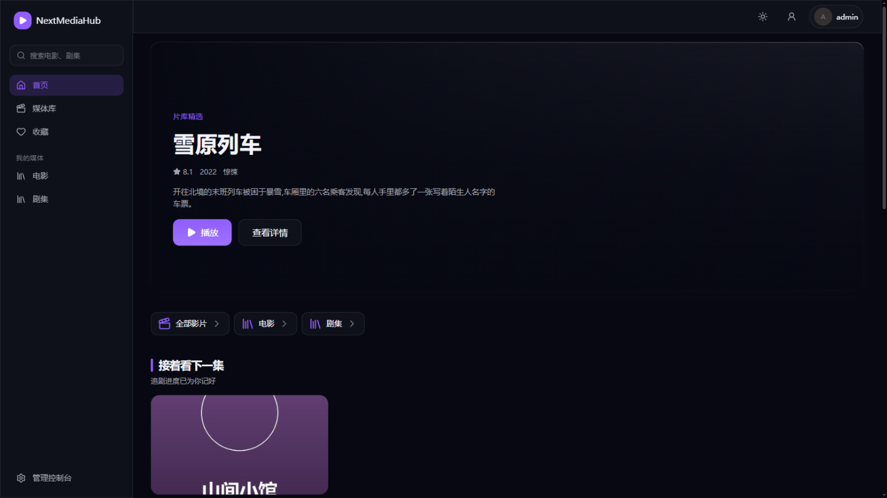
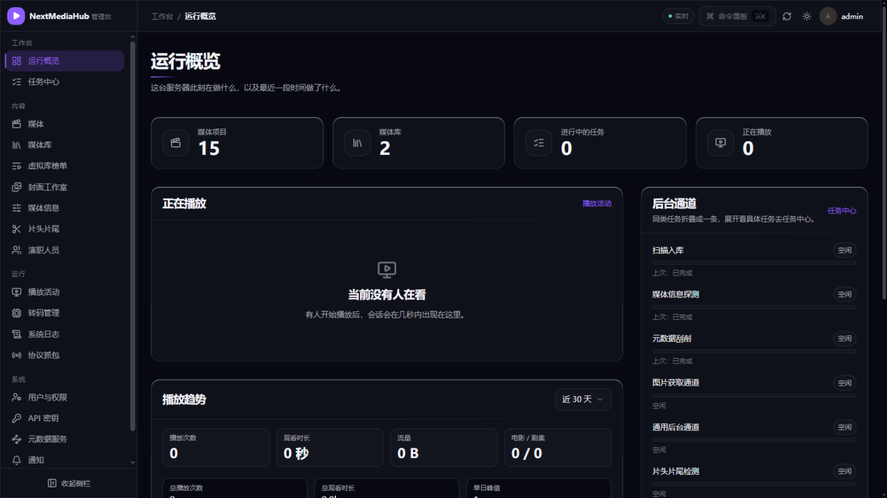

# 拾光 · Lumora 使用指南

拾光 · Lumora 是一款兼容 Emby 协议的私人媒体服务器。它可以将磁盘中的电影和剧集整理成海报墙，并通过网页、电视、手机或其他兼容 Emby 协议的客户端播放。

> 品牌升级说明：NextMediaHub 已正式更名为 **拾光 · Lumora**。部分截图及 Docker 镜像地址暂时沿用旧标识，不影响功能和使用。

## 快速开始

首次部署建议按以下顺序操作：

1. [使用 Docker Compose 安装并启动服务](01-安装部署.md)
2. 浏览器访问 `http://服务器地址:18096/`，[创建管理员账号](02-首次使用.md#2-创建管理员账号)
3. [创建媒体库](03-媒体库管理.md#1-新建媒体库)，并等待首次扫描完成
4. 返回观影端，开始浏览和播放媒体

## 按角色查阅

| 使用者 | 建议先看 |
| --- | --- |
| 初次部署的管理员 | [安装部署](01-安装部署.md) → [首次使用](02-首次使用.md) → [媒体库管理](03-媒体库管理.md) |
| 日常维护的管理员 | [任务与计划任务](07-任务与计划任务.md) → [日志与常见问题](09-日志与常见问题.md) |
| 从 Emby 迁移的管理员 | [Emby 数据导入](10-Emby数据导入.md) |
| 普通观影用户 | [观影使用](05-观影使用.md) → [Emby 客户端连接](02-首次使用.md#5-用-emby-客户端观看) |

## 完整目录

| 页面 | 内容 |
| --- | --- |
| [1. 安装部署](01-安装部署.md) | 使用 Docker Compose 启动、检查和升级服务 |
| [2. 首次使用](02-首次使用.md) | 创建管理员、认识界面、连接 Emby 客户端 |
| [3. 媒体库管理](03-媒体库管理.md) | 创建媒体库、扫描媒体和配置目录监听 |
| [4. 海报与简介（元数据）](04-元数据刮削.md) | 配置 TMDB/豆瓣并修正识别结果 |
| [5. 观影使用](05-观影使用.md) | 浏览、播放、搜索、收藏和续看 |
| [6. 用户与权限](06-用户与权限.md) | 管理账号、访问组和媒体库权限 |
| [7. 任务与计划任务](07-任务与计划任务.md) | 查看后台任务并配置定时维护 |
| [8. 特色功能](08-特色功能.md) | 封面工作室、片头片尾、求片和虚拟库 |
| [9. 日志与常见问题](09-日志与常见问题.md) | 查看日志、检查健康状态和排查故障 |
| [10. Emby 数据导入](10-Emby数据导入.md) | 迁移用户、观影记录、进度和收藏 |
| [11. 更新日志](11-更新日志.md) | 查看版本功能更新与问题修复 |

## 版本区别

| 对比项 | 基础版 | PLUS 版 | PRO 版 | MAX 版 |
| --- | --- | --- | --- | --- |
| 是否需要激活 | 无需激活 | 需要激活 | 需要激活 | 需要激活 |
| 用户账号总数上限 | 3 个 | 15 个 | 30 个 | 不限 |
| 基础功能 | 支持 | 支持 | 支持 | 支持 |
| 当前增值功能 | 不支持 | 不支持 | 支持 | 支持 |
| 未来增值功能 | 不支持 | 不支持 | 支持 | 支持 |
| 功能权益范围 | 基础功能 | 基础功能 | 全部功能 | 全部功能 |

当前增值功能包括**用户求片、豆瓣元数据和虚拟库**。PRO 版适合需要增值功能且用户数不超过 30 个的场景；MAX 版不限制用户账号总数，并包含全部功能权益。

> 用户上限统计所有账号，包括管理员。授权失效或停用后，系统会回到基础版权益；已有账号不受影响，但账号总数达到或超过 3 个时不能继续新增。授权入口位于 **管理控制台 → 系统 → 运行设置 → 版本与授权**。

## 界面速览

**观影端**供所有用户浏览、搜索和播放媒体：

**管理控制台**仅供管理员维护媒体库、用户和运行配置：

## 常用操作

| 目标 | 操作入口 |
| --- | --- |
| 添加电影或剧集目录 | 管理控制台 → 内容 → 媒体库 → 新建媒体库 |
| 修正错误的海报或简介 | 管理控制台 → 内容 → 媒体 → 打开影片 → 重新识别 |
| 创建用户账号 | 管理控制台 → 系统 → 用户与权限 → 新建用户 |
| 导入 Emby 数据 | 管理控制台 → 系统 → Emby 数据导入 |
| 修改自己的密码 | 右上角头像 → 账户与安全 |
| 检测剧集片头片尾 | 管理控制台 → 内容 → 片头片尾 |
| 生成媒体库封面 | 管理控制台 → 内容 → 封面工作室 |
| 查看实时播放与历史 | 管理控制台 → 运行 → 播放活动 |
